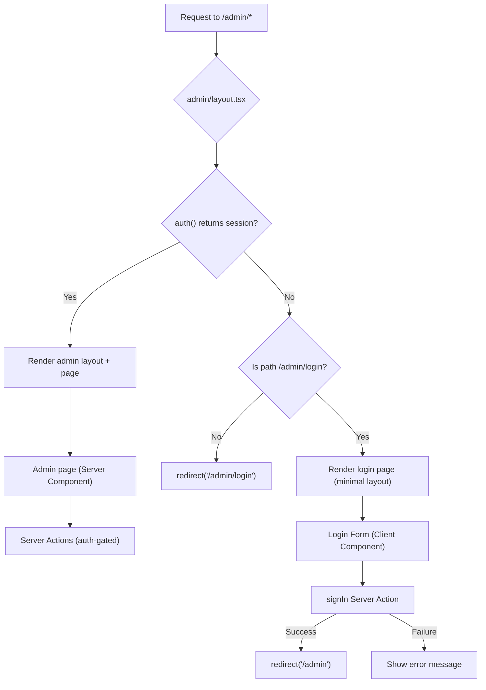

# Folder Structure — Nakoda Web

> **Enterprise-grade Next.js 15 App Router folder structure using feature-based architecture.**

---

## Table of Contents

1. [Overview](#1-overview)
2. [Complete Folder Tree](#2-complete-folder-tree)
3. [Directory Explanations](#3-directory-explanations)
4. [File Naming Conventions](#4-file-naming-conventions)
5. [Import Aliases](#5-import-aliases)
6. [Route Groups Explained](#6-route-groups-explained)
7. [Scalability Notes](#7-scalability-notes)
8. [Quick Reference Matrix](#8-quick-reference-matrix)

---

## 1. Overview

Nakoda Web follows a **feature-based, server-first architecture** built on Next.js 15 App Router with React 19 Server Components. The folder structure is designed around three core principles:

| Principle | Description |
|---|---|
| **Colocation** | Route-specific files live inside the `app/` directory; shared logic is extracted into dedicated top-level folders (`actions/`, `lib/`, `hooks/`, `types/`). |
| **Separation of Concerns** | Public storefront (`(store)/`), admin portal (`admin/`), and shared primitives (`components/ui/`) are physically isolated from each other. |
| **Server-First** | Server Components are the default. Client Components are explicitly marked with `"use client"` only when interactivity is required. Server Actions replace traditional API routes. |

### Architecture at a Glance

```
src/
├── app/          → Routes, layouts, pages (Next.js App Router conventions)
├── components/   → React components organized by domain
├── actions/      → Server Actions (data mutations & queries)
├── lib/          → Utility libraries, configs, singletons
├── hooks/        → Client-side custom React hooks
└── types/        → TypeScript type definitions & interfaces
```

### Key Technology Decisions

| Concern | Choice | Rationale |
|---|---|---|
| Routing | App Router (file-system) | Layouts, streaming, RSC support |
| Data Mutations | Server Actions | No API routes needed for V1; type-safe, colocated |
| Styling | Tailwind CSS v4 | Utility-first, zero-runtime, great DX |
| Animation | Framer Motion | Declarative, GPU-accelerated, React-native integration |
| Database | Prisma ORM + Neon PostgreSQL | Type-safe ORM, serverless Postgres, branching support |
| Authentication | Auth.js (NextAuth v5) | First-party Next.js integration, session strategies |
| Media | Cloudinary | On-the-fly transforms, CDN delivery, upload widget |
| Hosting | Vercel | Zero-config Next.js deployment, Edge Functions, Analytics |

---

## 2. Complete Folder Tree

> Every file in the project is listed below. Comments describe each file's responsibility.

```
nakoda-web/
│
│   ── Root Configuration ──────────────────────────────────────────────
│
├── .env.local                          # Local environment variables (secrets, DB URL, API keys)
├── .env.example                        # Environment variable template (committed to git)
├── .eslintrc.json                      # ESLint configuration (extends next/core-web-vitals)
├── .gitignore                          # Git ignore rules (node_modules, .next, .env.local)
├── .prettierrc                         # Prettier configuration (semi, singleQuote, tabWidth)
├── .prettierignore                     # Files excluded from Prettier formatting
├── next.config.ts                      # Next.js configuration (images, redirects, headers)
├── next-sitemap.config.js              # Sitemap generation configuration
├── package.json                        # Dependencies, scripts, engines
├── postcss.config.js                   # PostCSS configuration (Tailwind CSS plugin)
├── tailwind.config.ts                  # Tailwind CSS v4 configuration (theme, plugins)
├── tsconfig.json                       # TypeScript configuration (paths, strict mode)
├── README.md                           # Project overview and quick-start guide
│
│   ── Prisma (Database Layer) ─────────────────────────────────────────
│
├── prisma/
│   ├── schema.prisma                   # Database schema — models, relations, enums
│   ├── seed.ts                         # Database seeding script — sample data for development
│   └── migrations/                     # Auto-generated Prisma migration files
│       └── 20250101000000_init/
│           └── migration.sql           # Initial migration SQL
│
│   ── Public Assets ───────────────────────────────────────────────────
│
├── public/
│   ├── favicon.ico                     # Browser tab icon (32×32, multi-size ICO)
│   ├── logo.svg                        # Nakoda brand logo (scalable vector)
│   ├── og-image.jpg                    # Default Open Graph social preview image (1200×630)
│   └── images/
│       └── placeholder.jpg             # Fallback image for products without images
│
│   ── Source Code ─────────────────────────────────────────────────────
│
├── src/
│   │
│   │   ── App Router (Routes & Layouts) ───────────────────────────
│   │
│   ├── app/
│   │   ├── layout.tsx                  # Root layout — <html>, <body>, providers, fonts, metadata
│   │   ├── page.tsx                    # Homepage — hero, featured products, categories, CTA
│   │   ├── loading.tsx                 # Global loading UI — full-page skeleton/spinner
│   │   ├── error.tsx                   # Global error boundary — error recovery UI
│   │   ├── not-found.tsx               # 404 page — "Page not found" with navigation back
│   │   ├── globals.css                 # Global styles — Tailwind directives, CSS custom properties
│   │   ├── sitemap.ts                  # Dynamic sitemap generation — products, categories, pages
│   │   ├── robots.ts                   # Robots.txt generation — crawl rules, sitemap URL
│   │   │
│   │   │   ── Public Storefront Routes ────────────────────────
│   │   │
│   │   ├── (store)/                    # Route group — storefront (no URL segment added)
│   │   │   ├── layout.tsx              # Store layout — header, footer, WhatsApp FAB
│   │   │   │
│   │   │   ├── products/
│   │   │   │   ├── page.tsx            # Product listing — grid, filters, search, pagination
│   │   │   │   ├── loading.tsx         # Product listing skeleton (shimmer cards)
│   │   │   │   └── [slug]/
│   │   │   │       ├── page.tsx        # Product detail — gallery, info, inquiry CTA, related
│   │   │   │       └── loading.tsx     # Product detail skeleton
│   │   │   │
│   │   │   ├── categories/
│   │   │   │   ├── page.tsx            # All categories — grid of category cards
│   │   │   │   ├── loading.tsx         # Categories listing skeleton
│   │   │   │   └── [slug]/
│   │   │   │       ├── page.tsx        # Category products — filtered product grid
│   │   │   │       └── loading.tsx     # Category products skeleton
│   │   │   │
│   │   │   ├── collections/
│   │   │   │   ├── page.tsx            # All collections — curated collection cards
│   │   │   │   ├── loading.tsx         # Collections listing skeleton
│   │   │   │   └── [slug]/
│   │   │   │       ├── page.tsx        # Collection products — themed product grid
│   │   │   │       └── loading.tsx     # Collection products skeleton
│   │   │   │
│   │   │   ├── contact/
│   │   │   │   └── page.tsx            # Contact page — store info, map, contact form
│   │   │   │
│   │   │   ├── about/
│   │   │   │   └── page.tsx            # About page — brand story, team, values, heritage
│   │   │   │
│   │   │   └── inquiry/
│   │   │       └── page.tsx            # Inquiry form page — product inquiry with details
│   │   │
│   │   │   ── Admin Portal Routes ─────────────────────────────
│   │   │
│   │   └── admin/
│   │       ├── layout.tsx              # Admin layout — sidebar, top bar, auth guard
│   │       ├── page.tsx                # Admin dashboard — stats, recent inquiries, quick actions
│   │       ├── loading.tsx             # Admin dashboard skeleton
│   │       │
│   │       ├── login/
│   │       │   └── page.tsx            # Admin login — email/password form, session creation
│   │       │
│   │       ├── products/
│   │       │   ├── page.tsx            # Product list — data table, search, bulk actions
│   │       │   ├── loading.tsx         # Product list skeleton
│   │       │   ├── new/
│   │       │   │   └── page.tsx        # Create product — product form (empty)
│   │       │   └── [id]/
│   │       │       └── edit/
│   │       │           └── page.tsx    # Edit product — product form (pre-filled)
│   │       │
│   │       ├── categories/
│   │       │   ├── page.tsx            # Category management — CRUD table, inline edit
│   │       │   └── loading.tsx         # Category management skeleton
│   │       │
│   │       ├── collections/
│   │       │   ├── page.tsx            # Collection management — CRUD table, product assignment
│   │       │   └── loading.tsx         # Collection management skeleton
│   │       │
│   │       └── inquiries/
│   │           ├── page.tsx            # Inquiry list — table with status filters
│   │           ├── loading.tsx         # Inquiry list skeleton
│   │           └── [id]/
│   │               └── page.tsx        # Inquiry detail — full inquiry, status update, notes
│   │
│   │   ── Components ──────────────────────────────────────────
│   │
│   ├── components/
│   │   │
│   │   ├── ui/                         # ── Reusable UI Primitives ──
│   │   │   ├── button.tsx              # Button — variants: primary, secondary, outline, ghost, danger
│   │   │   ├── input.tsx               # Text input — with label, error, helper text support
│   │   │   ├── textarea.tsx            # Textarea — auto-resize, character count, validation
│   │   │   ├── select.tsx              # Select dropdown — native select with custom styling
│   │   │   ├── badge.tsx               # Badge — status indicators, tags (color variants)
│   │   │   ├── card.tsx                # Card — container with header, body, footer slots
│   │   │   ├── modal.tsx               # Modal dialog — overlay, focus trap, escape-to-close
│   │   │   ├── skeleton.tsx            # Skeleton loader — shimmer animation primitives
│   │   │   ├── toast.tsx               # Toast notifications — success, error, warning, info
│   │   │   ├── dropdown.tsx            # Dropdown menu — trigger + popover menu items
│   │   │   ├── pagination.tsx          # Pagination — page numbers, prev/next, page size
│   │   │   ├── search-input.tsx        # Search input — with debounce, clear button, icon
│   │   │   └── image-upload.tsx        # Image upload — drag-and-drop, preview, Cloudinary integration
│   │   │
│   │   ├── store/                      # ── Store-Specific Components ──
│   │   │   ├── header.tsx              # Store header — logo, navigation, mobile menu, search
│   │   │   ├── footer.tsx              # Store footer — links, social, newsletter, copyright
│   │   │   ├── hero-section.tsx        # Homepage hero — full-width banner, CTA, animated text
│   │   │   ├── product-card.tsx        # Product card — image, name, category, inquiry CTA
│   │   │   ├── product-grid.tsx        # Product grid — responsive grid of product cards
│   │   │   ├── product-gallery.tsx     # Product gallery — image carousel, zoom, thumbnails
│   │   │   ├── product-filters.tsx     # Product filters — category, collection, sort, price range
│   │   │   ├── category-card.tsx       # Category card — image, name, product count
│   │   │   ├── collection-card.tsx     # Collection card — featured image, title, description
│   │   │   ├── featured-products.tsx   # Featured products — homepage carousel/grid section
│   │   │   ├── inquiry-form.tsx        # Inquiry form — name, email, phone, message, product ref
│   │   │   ├── whatsapp-button.tsx     # WhatsApp FAB — floating button, pre-filled message
│   │   │   ├── store-info.tsx          # Store info — address, hours, phone, map embed
│   │   │   ├── breadcrumbs.tsx         # Breadcrumb navigation — auto-generated from route
│   │   │   └── newsletter-signup.tsx   # Newsletter signup — email input, subscribe action
│   │   │
│   │   ├── admin/                      # ── Admin-Specific Components ──
│   │   │   ├── sidebar.tsx             # Admin sidebar — navigation links, collapse toggle
│   │   │   ├── admin-header.tsx        # Admin top bar — breadcrumb, user menu, logout
│   │   │   ├── dashboard-stats.tsx     # Dashboard stats — cards showing key metrics
│   │   │   ├── product-form.tsx        # Product form — create/edit with image upload, validation
│   │   │   ├── product-table.tsx       # Product data table — sortable, searchable, paginated
│   │   │   ├── category-form.tsx       # Category form — name, slug, description, image
│   │   │   ├── collection-form.tsx     # Collection form — name, slug, description, products
│   │   │   ├── inquiry-table.tsx       # Inquiry data table — status badges, date, actions
│   │   │   ├── image-manager.tsx       # Image manager — gallery view, reorder, delete, upload
│   │   │   ├── delete-dialog.tsx       # Delete confirmation — modal with warning, confirm/cancel
│   │   │   └── login-form.tsx          # Admin login form — email, password, remember me, errors
│   │   │
│   │   └── shared/                     # ── Shared Components (Store + Admin) ──
│   │       ├── structured-data.tsx     # JSON-LD structured data — product, breadcrumb, org schemas
│   │       ├── optimized-image.tsx     # Image wrapper — next/image + Cloudinary transforms + blur
│   │       └── empty-state.tsx         # Empty state — icon, message, optional CTA
│   │
│   │   ── Server Actions ──────────────────────────────────────
│   │
│   ├── actions/
│   │   ├── product.actions.ts          # Product CRUD — create, read, update, delete, list, search
│   │   ├── category.actions.ts         # Category CRUD — create, read, update, delete, list
│   │   ├── collection.actions.ts       # Collection CRUD — create, read, update, delete, assign products
│   │   ├── inquiry.actions.ts          # Inquiry management — submit, list, update status, respond
│   │   ├── image.actions.ts            # Image operations — upload to Cloudinary, delete, reorder
│   │   └── auth.actions.ts             # Authentication — login, logout, session validation
│   │
│   │   ── Utility Libraries ───────────────────────────────────
│   │
│   ├── lib/
│   │   ├── prisma.ts                   # Prisma client singleton — prevents hot-reload connection leaks
│   │   ├── auth.ts                     # Auth.js configuration — providers, callbacks, session config
│   │   ├── cloudinary.ts               # Cloudinary configuration — SDK init, upload presets, transforms
│   │   ├── utils.ts                    # General utilities — cn(), formatPrice(), slugify(), etc.
│   │   ├── constants.ts                # App constants — site metadata, nav links, social URLs
│   │   └── validations.ts             # Zod schemas — form/action input validation schemas
│   │
│   │   ── Custom Hooks ────────────────────────────────────────
│   │
│   ├── hooks/
│   │   ├── use-debounce.ts             # Debounce hook — delays value updates (search input, etc.)
│   │   ├── use-media-query.ts          # Media query hook — responsive breakpoint detection
│   │   └── use-toast.ts               # Toast hook — imperative toast trigger (show, dismiss)
│   │
│   │   ── TypeScript Types ────────────────────────────────────
│   │
│   └── types/
│       ├── index.ts                    # Shared types — pagination, API response envelopes, common
│       ├── product.ts                  # Product types — Product, ProductWithImages, ProductFilters
│       ├── category.ts                 # Category types — Category, CategoryWithProducts
│       ├── inquiry.ts                  # Inquiry types — Inquiry, InquiryStatus, InquiryFilters
│       └── auth.ts                     # Auth types — User, Session, LoginCredentials
│
│   ── Documentation ───────────────────────────────────────────────────
│
└── docs/
    ├── FOLDER_STRUCTURE.md             # This document — project structure reference
    ├── DATABASE_SCHEMA.md              # Prisma schema documentation and ERD
    ├── TECH_STACK.md                   # Technology choices and rationale
    ├── COMPONENT_GUIDE.md              # Component API reference and usage
    ├── DEPLOYMENT.md                   # Deployment and environment setup guide
    └── API_REFERENCE.md               # Server Actions API documentation
```

---

## 3. Directory Explanations

### 3.1 `src/app/` — App Router (Routes & Layouts)

| Attribute | Detail |
|---|---|
| **Purpose** | Defines the application's URL structure using Next.js 15 file-system routing. Each folder maps to a URL segment; special files (`page.tsx`, `layout.tsx`, `loading.tsx`, `error.tsx`) control rendering behavior. |
| **What belongs here** | Route segments (folders), `page.tsx` (route UI), `layout.tsx` (shared wrappers), `loading.tsx` (Suspense fallback), `error.tsx` (error boundary), `not-found.tsx` (404), metadata files (`sitemap.ts`, `robots.ts`, `opengraph-image.*`). |
| **Naming convention** | Folders use **lowercase kebab-case**. Dynamic segments use `[param]` syntax. Route groups use `(name)` syntax. |
| **What does NOT belong** | Reusable components, business logic, utility functions, type definitions, Server Action implementations. These live in their respective top-level `src/` directories. |

#### Root-Level App Files

| File | Type | Description |
|---|---|---|
| `layout.tsx` | Server Component | Root `<html>` and `<body>` wrapper. Loads Google Fonts (Inter, Playfair Display), global metadata, `<Providers>` wrapper (theme, toast, auth session). Every page inherits this layout. |
| `page.tsx` | Server Component | Homepage. Composes `<HeroSection>`, `<FeaturedProducts>`, `<CategoryGrid>`, `<AboutPreview>`, and `<CTASection>`. Fetches featured products via Server Action. |
| `loading.tsx` | Client Component | Full-page loading skeleton. Rendered by React Suspense when navigating between routes at the root level. |
| `error.tsx` | Client Component | Global error boundary. Catches unhandled errors, displays a recovery UI with "Try Again" button. Must be `"use client"`. |
| `not-found.tsx` | Server Component | Custom 404 page. Shows a branded "Page Not Found" message with link back to homepage. |
| `globals.css` | Stylesheet | Tailwind CSS v4 directives (`@import "tailwindcss"`), CSS custom properties for brand colors, global resets, font-face declarations, utility classes. |
| `sitemap.ts` | Route Handler | Dynamically generates `sitemap.xml` by querying all published products, categories, and collections from the database. |
| `robots.ts` | Route Handler | Generates `robots.txt` — allows all crawlers, disallows `/admin/*`, references sitemap URL. |

---

### 3.2 `src/app/(store)/` — Public Storefront Route Group

| Attribute | Detail |
|---|---|
| **Purpose** | Groups all customer-facing pages under a shared layout (header + footer) without adding a `/store` URL segment. Visitors access these pages directly at `/products`, `/categories`, `/contact`, etc. |
| **What belongs here** | All public-facing routes — product listing/detail, categories, collections, contact, about, inquiry. |
| **Naming convention** | Route folders use **lowercase kebab-case** matching their URL path. |
| **What does NOT belong** | Admin pages, authentication flows, API routes, any page that requires authentication to access. |

#### Route Breakdown

| Route Path | File | Component Type | Description |
|---|---|---|---|
| `/products` | `products/page.tsx` | Server Component | Fetches paginated product list with optional filters (category, collection, search query, sort). Renders `<ProductGrid>` with `<ProductFilters>` sidebar. Supports URL-based filter state via `searchParams`. |
| `/products/[slug]` | `products/[slug]/page.tsx` | Server Component | Fetches single product by slug with images and related products. Renders `<ProductGallery>`, product details, inquiry CTA, `<StructuredData>` (JSON-LD). Uses `generateMetadata` for dynamic SEO. `generateStaticParams` for ISR. |
| `/categories` | `categories/page.tsx` | Server Component | Fetches all categories with product counts. Renders grid of `<CategoryCard>` components. |
| `/categories/[slug]` | `categories/[slug]/page.tsx` | Server Component | Fetches category by slug and its products. Renders category header + `<ProductGrid>` filtered to that category. |
| `/collections` | `collections/page.tsx` | Server Component | Fetches all active collections. Renders grid of `<CollectionCard>` components with featured imagery. |
| `/collections/[slug]` | `collections/[slug]/page.tsx` | Server Component | Fetches collection by slug and its curated products. Renders collection banner + `<ProductGrid>`. |
| `/contact` | `contact/page.tsx` | Server Component | Static contact information page. Renders `<StoreInfo>` (address, hours, phone), embedded Google Map, and a contact form wired to `inquiry.actions.ts`. |
| `/about` | `about/page.tsx` | Server Component | Static brand storytelling page. Heritage narrative, craftsmanship values, team photos. Minimal data fetching — mostly static content. |
| `/inquiry` | `inquiry/page.tsx` | Server Component | Standalone inquiry form page. Pre-populates product reference if linked from a product detail page (via `searchParams`). Uses `<InquiryForm>` with `inquiry.actions.ts`. |

#### Store Layout (`layout.tsx`)

```tsx
// src/app/(store)/layout.tsx
// Wraps all storefront pages with consistent navigation and footer.
// Includes: <Header>, <main>{children}</main>, <Footer>, <WhatsAppButton>
// Does NOT include admin sidebar or admin auth checks.
```

---

### 3.3 `src/app/admin/` — Admin Portal Routes

| Attribute | Detail |
|---|---|
| **Purpose** | Self-contained admin portal for managing products, categories, collections, and customer inquiries. All routes are nested under `/admin/*` and protected by authentication. |
| **What belongs here** | Admin dashboard, CRUD pages for products/categories/collections, inquiry management, admin login. |
| **Naming convention** | Folders match URL segments. CRUD pattern: `feature/page.tsx` (list), `feature/new/page.tsx` (create), `feature/[id]/edit/page.tsx` (edit). |
| **What does NOT belong** | Customer-facing pages, public content, e-commerce checkout flows, public API endpoints. |

#### Route Breakdown

| Route Path | File | Component Type | Description |
|---|---|---|---|
| `/admin` | `page.tsx` | Server Component | Dashboard — fetches aggregate stats (total products, categories, pending inquiries, recent activity). Renders `<DashboardStats>` cards and recent inquiries table. |
| `/admin/login` | `login/page.tsx` | Server Component | Login page — renders `<LoginForm>`. Redirects to `/admin` if already authenticated. Does **not** use the admin layout (no sidebar). |
| `/admin/products` | `products/page.tsx` | Server Component | Product list — paginated `<ProductTable>` with search, filter by category, bulk delete. Server-side pagination via `searchParams`. |
| `/admin/products/new` | `products/new/page.tsx` | Server Component | Create product — renders empty `<ProductForm>` bound to `createProduct` Server Action. |
| `/admin/products/[id]/edit` | `products/[id]/edit/page.tsx` | Server Component | Edit product — fetches product by ID, renders pre-filled `<ProductForm>` bound to `updateProduct` Server Action. |
| `/admin/categories` | `categories/page.tsx` | Server Component | Category management — inline CRUD table with `<CategoryForm>` modal for create/edit. |
| `/admin/collections` | `collections/page.tsx` | Server Component | Collection management — CRUD table with `<CollectionForm>` modal, product assignment UI. |
| `/admin/inquiries` | `inquiries/page.tsx` | Server Component | Inquiry list — `<InquiryTable>` with status filter tabs (New, In Progress, Resolved). |
| `/admin/inquiries/[id]` | `inquiries/[id]/page.tsx` | Server Component | Inquiry detail — full inquiry view, status update dropdown, internal notes, customer contact info. |

#### Admin Layout (`layout.tsx`)

```tsx
// src/app/admin/layout.tsx
// 1. Checks authentication via auth() from Auth.js
// 2. If unauthenticated → redirect to /admin/login
// 3. If authenticated → renders <AdminHeader> + <Sidebar> + <main>{children}</main>
// 4. Login page opts out of this layout by using its own minimal layout
```

#### Authentication Guard Strategy

```
Request → admin/layout.tsx
          ├─ auth() returns session? → Render admin UI
          └─ No session? → redirect("/admin/login")

Exception: /admin/login is the login page itself.
The login page's parent layout still runs the auth check,
but the login page component handles the redirect-if-authenticated logic.
```

---

### 3.4 `src/components/` — React Components

The components directory is organized into **four subdirectories** by domain scope. This prevents cross-contamination between storefront and admin UI code while encouraging reuse of design-system primitives.

```
components/
├── ui/       → Design system primitives (used everywhere)
├── store/    → Storefront-specific compositions
├── admin/    → Admin portal-specific compositions
└── shared/   → Cross-cutting components (used by both store + admin)
```

---

### 3.5 `src/components/ui/` — Reusable UI Primitives

| Attribute | Detail |
|---|---|
| **Purpose** | Design system foundation. Atomic, headless-ish UI components that encapsulate styling patterns but remain domain-agnostic. These are the building blocks used by both store and admin components. |
| **What belongs here** | Buttons, inputs, modals, cards, badges, skeletons, toasts — any component that is purely UI with no business logic. |
| **Naming convention** | `kebab-case.tsx` — single-word or hyphenated descriptive noun (`button.tsx`, `search-input.tsx`, `image-upload.tsx`). |
| **What does NOT belong** | Components with business logic, data fetching, or domain-specific props (e.g., `product-card.tsx` belongs in `store/`, not `ui/`). |

#### Component Inventory

| Component | Client? | Props Pattern | Description |
|---|---|---|---|
| `button.tsx` | Yes | `variant`, `size`, `loading`, `disabled`, `asChild` | Multi-variant button with loading spinner. Uses `cva` (class-variance-authority) for variant management. Supports `asChild` for polymorphic rendering (e.g., as `<Link>`). |
| `input.tsx` | Yes | `label`, `error`, `helperText`, `leftIcon`, `rightIcon` | Controlled text input with floating label, validation error display, and icon slots. Wraps native `<input>` with `React.forwardRef`. |
| `textarea.tsx` | Yes | `label`, `error`, `maxLength`, `autoResize` | Auto-resizing textarea with character counter and validation. |
| `select.tsx` | Yes | `label`, `error`, `options`, `placeholder` | Styled native `<select>` with label and error state. Options accept `{ value, label }` array. |
| `badge.tsx` | No | `variant`, `size` | Status badge/tag. Variants: `default`, `success`, `warning`, `danger`, `info`. Used for inquiry status, product status, etc. |
| `card.tsx` | No | `children`, `className`, `hover` | Container with rounded corners, shadow, and optional hover elevation. Composable with `<CardHeader>`, `<CardBody>`, `<CardFooter>`. |
| `modal.tsx` | Yes | `open`, `onClose`, `title`, `children` | Dialog overlay with focus trap, ESC to close, click-outside to close. Uses React Portal. Animated with Framer Motion. |
| `skeleton.tsx` | No | `className`, `lines`, `circle` | Shimmer-animated placeholder. Supports rectangle, circle, and multi-line text shapes. Used in `loading.tsx` files. |
| `toast.tsx` | Yes | Imperative via `useToast` hook | Toast notification system. Position: bottom-right. Auto-dismiss with progress bar. Types: success, error, warning, info. |
| `dropdown.tsx` | Yes | `trigger`, `items`, `align` | Dropdown menu with keyboard navigation. Items support icons, dividers, and danger styling. |
| `pagination.tsx` | Yes | `currentPage`, `totalPages`, `onPageChange` | Page navigation with first/prev/next/last, ellipsis for large page counts, and page size selector. Uses URL search params for server-side pagination. |
| `search-input.tsx` | Yes | `value`, `onChange`, `placeholder`, `debounceMs` | Search field with magnifying glass icon, clear button, and built-in debounce (300ms default). |
| `image-upload.tsx` | Yes | `value`, `onChange`, `multiple`, `maxFiles` | Drag-and-drop image upload zone. Shows previews, progress bars, file size validation. Integrates with Cloudinary via `image.actions.ts`. |

---

### 3.6 `src/components/store/` — Store-Specific Components

| Attribute | Detail |
|---|---|
| **Purpose** | Feature components specific to the public-facing storefront. These compose UI primitives with domain logic and store-specific data shapes. |
| **What belongs here** | Components rendered on customer-facing pages — product cards, gallery, navigation, hero sections, inquiry forms. |
| **Naming convention** | `kebab-case.tsx` — descriptive names prefixed with domain context where helpful (`product-card.tsx`, `hero-section.tsx`). |
| **What does NOT belong** | Admin-specific components (data tables, admin forms, sidebar). Generic UI primitives (those go in `ui/`). |

#### Component Inventory

| Component | Client? | Description |
|---|---|---|
| `header.tsx` | Yes | Site header. Logo, primary navigation (`Products`, `Categories`, `Collections`, `About`, `Contact`), mobile hamburger menu with slide-out drawer, search trigger. Sticky on scroll with backdrop blur. |
| `footer.tsx` | No | Site footer. Four-column layout: brand info, quick links, categories, contact. Social media icons. Newsletter signup inline form. Copyright with current year. |
| `hero-section.tsx` | Yes | Full-viewport hero banner. Auto-rotating background images with Ken Burns effect (Framer Motion). Headline, subheadline, dual CTA buttons. Responsive text sizing. |
| `product-card.tsx` | Yes | Product card for grids. Cloudinary image with hover zoom, product name, category badge, "Inquire Now" button. Uses `<OptimizedImage>`. Framer Motion hover/tap animations. |
| `product-grid.tsx` | No | Responsive CSS Grid wrapper for `<ProductCard>` arrays. Handles 1/2/3/4 column breakpoints. Renders `<EmptyState>` when no products. |
| `product-gallery.tsx` | Yes | Image gallery for product detail page. Main image with zoom-on-hover, thumbnail strip, swipe gestures on mobile, fullscreen lightbox mode. Framer Motion `AnimatePresence` for transitions. |
| `product-filters.tsx` | Yes | Sidebar/top-bar filter panel. Category multi-select, collection filter, sort options (newest, name A-Z, name Z-A), clear all. Updates URL `searchParams` for server-side filtering. |
| `category-card.tsx` | Yes | Category showcase card. Full-bleed category image, overlay gradient, category name, product count badge. Links to `/categories/[slug]`. |
| `collection-card.tsx` | Yes | Collection showcase card. Featured collection image, title, short description, "View Collection" link. |
| `featured-products.tsx` | No | Homepage section. Heading + `<ProductGrid>` showing products marked as `isFeatured: true`. Server Component — fetches data directly. |
| `inquiry-form.tsx` | Yes | Multi-field inquiry form. Fields: name, email, phone, message, product reference (hidden if standalone). Client-side validation with Zod. Submits via `submitInquiry` Server Action. Success/error toast feedback. |
| `whatsapp-button.tsx` | Yes | Floating action button (bottom-right). WhatsApp icon. Opens `wa.me` link with pre-filled message including current page URL. Animated entrance with Framer Motion. |
| `store-info.tsx` | No | Store details block. Address, phone number (click-to-call), email, business hours table, embedded Google Maps `<iframe>`. |
| `breadcrumbs.tsx` | No | Breadcrumb navigation. Auto-generates from URL segments. Renders JSON-LD `BreadcrumbList` structured data. Last item is non-linked current page. |
| `newsletter-signup.tsx` | Yes | Inline email subscription form. Email input + submit button. Connected to a Server Action (can integrate Mailchimp/Resend in future). |

---

### 3.7 `src/components/admin/` — Admin-Specific Components

| Attribute | Detail |
|---|---|
| **Purpose** | Feature components exclusive to the admin portal. These handle data management, CRUD interfaces, and admin-specific UI patterns (data tables, dashboards, forms). |
| **What belongs here** | Admin sidebar, dashboard widgets, data tables, CRUD forms, image manager, confirmation dialogs. |
| **Naming convention** | `kebab-case.tsx` — prefixed with domain context (`product-form.tsx`, `inquiry-table.tsx`). Admin-layout components use descriptive names (`sidebar.tsx`, `admin-header.tsx`). |
| **What does NOT belong** | Customer-facing components. Generic UI primitives. Public page sections. |

#### Component Inventory

| Component | Client? | Description |
|---|---|---|
| `sidebar.tsx` | Yes | Collapsible sidebar navigation. Links: Dashboard, Products, Categories, Collections, Inquiries. Active state highlighting based on current path. Collapse to icon-only on mobile. Badge counts for pending inquiries. |
| `admin-header.tsx` | Yes | Top navigation bar. Breadcrumb trail, "View Store" external link, user avatar dropdown (profile, logout). |
| `dashboard-stats.tsx` | No | Stats cards row. Displays: Total Products, Total Categories, Pending Inquiries, This Month's Inquiries. Each card shows count + trend indicator. Server Component — fetches counts directly. |
| `product-form.tsx` | Yes | Comprehensive product create/edit form. Fields: name, slug (auto-generated), description (rich text), category select, collection multi-select, `isFeatured` toggle, status toggle (draft/published), image upload via `<ImageManager>`. Form state managed with `useActionState`. Validated with Zod schema. |
| `product-table.tsx` | Yes | Sortable, searchable data table for products. Columns: Image thumbnail, Name, Category, Status, Date, Actions (Edit, Delete). Row click → edit page. Bulk selection + bulk delete. Server-side pagination and sorting via URL search params. |
| `category-form.tsx` | Yes | Category create/edit form rendered in a `<Modal>`. Fields: name, slug (auto-generated from name), description, image upload. Validated with Zod. Submits via Server Action. |
| `collection-form.tsx` | Yes | Collection create/edit form rendered in a `<Modal>`. Fields: name, slug, description, featured image, product multi-select assignment. |
| `inquiry-table.tsx` | Yes | Inquiry data table. Columns: Customer Name, Email, Product, Status (badge), Date, Actions. Status filter tabs: All, New, In Progress, Resolved. Click → detail page. |
| `image-manager.tsx` | Yes | Multi-image management interface for product editing. Drag-to-reorder (via `@dnd-kit`), delete with confirmation, upload new images, set primary/cover image. Integrates with `image.actions.ts` for Cloudinary operations. |
| `delete-dialog.tsx` | Yes | Confirmation modal for destructive actions. "Are you sure?" message with entity name, Cancel and Delete buttons. Delete button shows loading state during Server Action execution. |
| `login-form.tsx` | Yes | Admin login form. Email and password fields, "Remember Me" checkbox, error message display, submit loading state. Calls `signIn` Server Action. |

---

### 3.8 `src/components/shared/` — Shared Components

| Attribute | Detail |
|---|---|
| **Purpose** | Components used by **both** the storefront and admin portal. These are truly cross-cutting concerns that don't belong exclusively to either domain. |
| **What belongs here** | Components that are used in both `store/` and `admin/` contexts — image rendering, structured data, empty states. |
| **Naming convention** | `kebab-case.tsx` — descriptive, domain-agnostic names. |
| **What does NOT belong** | Components used only in store (→ `store/`), components used only in admin (→ `admin/`), pure UI primitives (→ `ui/`). |

#### Component Inventory

| Component | Client? | Description |
|---|---|---|
| `structured-data.tsx` | No | Renders `<script type="application/ld+json">` in `<head>`. Supports schemas: `Product`, `BreadcrumbList`, `Organization`, `LocalBusiness`, `WebSite`. Used by product detail pages (store) and potentially admin preview. |
| `optimized-image.tsx` | No | Wrapper around `next/image` with Cloudinary URL transformation. Accepts a Cloudinary public ID, generates responsive `srcSet` with automatic format (WebP/AVIF), blur placeholder from Cloudinary low-quality transform. Used everywhere images are displayed. |
| `empty-state.tsx` | No | Placeholder for empty data states. Customizable icon (Lucide React), heading, description, and optional CTA button. Used in both product grids (store: "No products found") and admin tables (admin: "No inquiries yet"). |

---

### 3.9 `src/actions/` — Server Actions

| Attribute | Detail |
|---|---|
| **Purpose** | Centralized Server Action modules. Each file contains `"use server"` functions that handle data mutations and queries. These replace traditional API routes for V1, providing type-safe, server-side data operations callable directly from Server and Client Components. |
| **What belongs here** | Functions marked with `"use server"` that perform database operations (via Prisma), file operations (Cloudinary uploads), authentication flows, and form submissions. |
| **Naming convention** | `feature.actions.ts` — feature name followed by `.actions.ts` suffix. |
| **What does NOT belong** | Client-side logic, React components, utility functions (→ `lib/`), type definitions (→ `types/`). |

#### Action Modules

| File | Functions | Description |
|---|---|---|
| `product.actions.ts` | `getProducts`, `getProductBySlug`, `getProductById`, `getFeaturedProducts`, `createProduct`, `updateProduct`, `deleteProduct`, `searchProducts` | Full product CRUD. Read operations return typed objects with included relations (images, category, collections). Write operations validate input with Zod schemas from `lib/validations.ts`, check admin auth, and `revalidatePath` on mutation. |
| `category.actions.ts` | `getCategories`, `getCategoryBySlug`, `getCategoryById`, `createCategory`, `updateCategory`, `deleteCategory` | Category CRUD. `getCategories` includes `_count` of products per category. Delete checks for associated products and prevents deletion if products exist (or cascades based on config). |
| `collection.actions.ts` | `getCollections`, `getCollectionBySlug`, `getCollectionById`, `createCollection`, `updateCollection`, `deleteCollection`, `assignProducts`, `removeProducts` | Collection CRUD plus product assignment management. Collections have a many-to-many relationship with products. |
| `inquiry.actions.ts` | `submitInquiry`, `getInquiries`, `getInquiryById`, `updateInquiryStatus`, `deleteInquiry` | Public-facing `submitInquiry` (no auth required) and admin-only management functions (auth required). Status transitions: `NEW` → `IN_PROGRESS` → `RESOLVED`. |
| `image.actions.ts` | `uploadImage`, `deleteImage`, `reorderImages`, `getProductImages` | Cloudinary integration. `uploadImage` accepts `FormData`, uploads to Cloudinary, stores URL + public ID in database. `deleteImage` removes from both Cloudinary and database. `reorderImages` updates `sortOrder` field. |
| `auth.actions.ts` | `signIn`, `signOut`, `getSession` | Auth.js wrapper actions. `signIn` validates credentials against database (bcrypt-hashed password), creates session. `signOut` destroys session and redirects. `getSession` returns current session or `null`. |

#### Server Action Patterns

```tsx
// Standard Server Action pattern used throughout:
"use server";

import { revalidatePath } from "next/cache";
import { redirect } from "next/navigation";
import { auth } from "@/lib/auth";
import { prisma } from "@/lib/prisma";
import { productSchema } from "@/lib/validations";

export async function createProduct(formData: FormData) {
  // 1. Auth check
  const session = await auth();
  if (!session) throw new Error("Unauthorized");

  // 2. Parse and validate input
  const parsed = productSchema.safeParse(Object.fromEntries(formData));
  if (!parsed.success) return { error: parsed.error.flatten() };

  // 3. Database operation
  const product = await prisma.product.create({ data: parsed.data });

  // 4. Cache invalidation
  revalidatePath("/admin/products");
  revalidatePath("/products");

  // 5. Redirect or return
  redirect(`/admin/products/${product.id}/edit`);
}
```

---

### 3.10 `src/lib/` — Utility Libraries

| Attribute | Detail |
|---|---|
| **Purpose** | Shared utility code, configuration singletons, and helper functions. Everything in `lib/` is framework-agnostic (no React imports) and can be used by both Server and Client Components. |
| **What belongs here** | Database client initialization, auth configuration, third-party SDK setup, pure utility functions, constants, validation schemas. |
| **Naming convention** | `descriptive-name.ts` — short, clear names that describe the module's purpose. |
| **What does NOT belong** | React components, React hooks (→ `hooks/`), Server Actions (→ `actions/`), type-only files (→ `types/`). |

#### Module Details

| File | Description |
|---|---|
| `prisma.ts` | **Prisma Client Singleton.** Creates a single `PrismaClient` instance and caches it on `globalThis` in development to survive Next.js hot reloads. In production, a fresh instance is created per cold start. Configures query logging in dev. |
| `auth.ts` | **Auth.js Configuration.** Exports `auth`, `signIn`, `signOut`, and `handlers`. Configures `CredentialsProvider` with email/password validation against the `Admin` table. Defines JWT session strategy, session callbacks (attach user ID/role), and authorized routes. |
| `cloudinary.ts` | **Cloudinary SDK Configuration.** Initializes the `cloudinary` SDK with `CLOUDINARY_CLOUD_NAME`, `CLOUDINARY_API_KEY`, and `CLOUDINARY_API_SECRET`. Exports helper functions: `uploadToCloudinary(file)`, `deleteFromCloudinary(publicId)`, `getCloudinaryUrl(publicId, transforms)`. Defines upload presets and transformation defaults (quality auto, format auto). |
| `utils.ts` | **General Utilities.** `cn(...classes)` — Tailwind class merger using `clsx` + `tailwind-merge`. `formatPrice(amount)` — locale-aware currency formatting (₹). `slugify(text)` — URL-safe slug generation. `truncate(text, length)` — text truncation with ellipsis. `formatDate(date)` — consistent date formatting. `generateMetadata(title, description)` — metadata helper. |
| `constants.ts` | **Application Constants.** `SITE_CONFIG` — site name, description, URL, OG image. `NAV_LINKS` — navigation link definitions. `SOCIAL_LINKS` — social media URLs. `WHATSAPP_NUMBER` — store WhatsApp number. `ITEMS_PER_PAGE` — default pagination size. `IMAGE_SIZES` — responsive image breakpoints. `INQUIRY_STATUSES` — status enum values. |
| `validations.ts` | **Zod Validation Schemas.** `productSchema` — validates product create/edit form data. `categorySchema` — validates category form. `collectionSchema` — validates collection form. `inquirySchema` — validates inquiry submission (public-facing, no auth). `loginSchema` — validates admin login credentials. Each schema exports both the schema and inferred TypeScript type. |

---

### 3.11 `src/hooks/` — Custom React Hooks

| Attribute | Detail |
|---|---|
| **Purpose** | Reusable client-side React hooks that encapsulate stateful logic, browser API interactions, and side effects. All hooks are `"use client"` and follow React naming conventions. |
| **What belongs here** | Custom hooks prefixed with `use` that provide reusable client-side logic — debouncing, media queries, imperative UI triggers. |
| **Naming convention** | `use-feature-name.ts` — kebab-case with `use-` prefix. |
| **What does NOT belong** | Server-side logic, React components, utility functions without React state/effects, type definitions. |

#### Hook Details

| Hook | Arguments | Returns | Description |
|---|---|---|---|
| `use-debounce.ts` | `value: T`, `delay: number` | `debouncedValue: T` | Delays updating the returned value until `delay` ms have passed since the last `value` change. Used by `<SearchInput>` to avoid firing server queries on every keystroke. |
| `use-media-query.ts` | `query: string` | `matches: boolean` | Subscribes to a CSS media query and returns whether it currently matches. Used for responsive behavior in client components (e.g., switch from sidebar to bottom sheet on mobile). SSR-safe with `false` default. |
| `use-toast.ts` | — | `{ toast, dismiss, toasts }` | Imperative toast API. `toast({ title, description, variant })` shows a notification. `dismiss(id)` removes one. `toasts` is the current toast array for rendering `<Toast>` components. Uses React context under the hood. |

---

### 3.12 `src/types/` — TypeScript Type Definitions

| Attribute | Detail |
|---|---|
| **Purpose** | Centralized TypeScript type definitions, interfaces, and type utilities. Keeps type information separate from implementation to allow imports without side effects and improve code navigation. |
| **What belongs here** | Interfaces, types, enums, and type utilities that define data shapes across the application. Types derived from Prisma models with additional computed fields or UI-specific extensions. |
| **Naming convention** | `feature.ts` — one file per domain feature. `index.ts` for shared/cross-cutting types. |
| **What does NOT belong** | Runtime code, validation logic (→ `lib/validations.ts`), Prisma model definitions (→ `prisma/schema.prisma`), component props (define inline or co-locate). |

#### Type Module Details

| File | Key Types | Description |
|---|---|---|
| `index.ts` | `PaginatedResponse<T>`, `ActionResponse<T>`, `SortDirection`, `PageProps`, `SearchParams` | Shared generic types used across multiple features. `PaginatedResponse` wraps paginated query results. `ActionResponse` standardizes Server Action return values (`{ success, data?, error? }`). `SearchParams` types URL query parameters. |
| `product.ts` | `Product`, `ProductWithImages`, `ProductWithCategory`, `ProductFilters`, `ProductSortField`, `CreateProductInput`, `UpdateProductInput` | Product-related types. `ProductWithImages` extends the Prisma `Product` type with `images: Image[]` relation. `ProductFilters` defines the shape of filter parameters for product listing. |
| `category.ts` | `Category`, `CategoryWithProducts`, `CategoryWithCount`, `CreateCategoryInput`, `UpdateCategoryInput` | Category types. `CategoryWithCount` includes `_count: { products: number }` for display in category cards. |
| `inquiry.ts` | `Inquiry`, `InquiryWithProduct`, `InquiryStatus`, `InquiryFilters`, `CreateInquiryInput`, `UpdateInquiryStatusInput` | Inquiry types. `InquiryStatus` is a union type: `"NEW" \| "IN_PROGRESS" \| "RESOLVED"`. `InquiryFilters` includes status and date range filtering. |
| `auth.ts` | `User`, `Session`, `LoginCredentials`, `AuthError` | Authentication types. `User` represents the admin user (id, email, name, role). `Session` extends the Auth.js session with custom properties. |

---

### 3.13 `prisma/` — Database Layer

| Attribute | Detail |
|---|---|
| **Purpose** | Prisma ORM configuration — schema definition, database migrations, and seed data. This directory is the single source of truth for the database structure. |
| **What belongs here** | `schema.prisma` (models, relations, enums), `seed.ts` (development data), `migrations/` (auto-generated migration SQL). |
| **Naming convention** | Fixed names dictated by Prisma conventions. `schema.prisma` is required. `seed.ts` is referenced in `package.json`. |
| **What does NOT belong** | Application code, queries (→ `actions/`), type definitions derived from schema (→ `types/`). |

#### File Details

| File | Description |
|---|---|
| `schema.prisma` | Defines models: `Product`, `Category`, `Collection`, `Image`, `Inquiry`, `Admin`. Configures Neon PostgreSQL datasource, Prisma Client generator. Defines enums: `InquiryStatus`, `ProductStatus`. Sets up relations: Product ↔ Category (many-to-one), Product ↔ Collection (many-to-many), Product ↔ Image (one-to-many), Inquiry ↔ Product (many-to-one). |
| `seed.ts` | Populates the database with sample data for local development. Creates: 1 admin user (hashed password), 5–8 categories, 2–3 collections, 15–20 sample products with images, 5–10 sample inquiries. Uses `prisma.upsert` for idempotent seeding. Run via `npx prisma db seed`. |
| `migrations/` | Auto-generated by `npx prisma migrate dev`. Each migration folder contains a `migration.sql` file with the SQL statements for that schema change. **Never manually edit migration files.** |

---

### 3.14 `public/` — Static Assets

| Attribute | Detail |
|---|---|
| **Purpose** | Static files served at the web root. These files are not processed by the Next.js build pipeline — they are served as-is at their file path (e.g., `public/logo.svg` → `https://domain.com/logo.svg`). |
| **What belongs here** | Favicon, brand logo, Open Graph default image, fallback placeholder images. |
| **Naming convention** | `kebab-case` for readability. Descriptive names (`og-image.jpg`, `placeholder.jpg`). |
| **What does NOT belong** | Product images (→ Cloudinary), large media files, dynamically generated assets, anything that should be version-hashed by the build system. |

---

### 3.15 `docs/` — Project Documentation

| Attribute | Detail |
|---|---|
| **Purpose** | Project documentation for developers, designers, and stakeholders. Lives alongside the codebase for version control and easy access. |
| **What belongs here** | Architecture documents, setup guides, API references, schema documentation, deployment guides, decision records. |
| **Naming convention** | `UPPER_SNAKE_CASE.md` for primary docs. Lowercase kebab-case for supplementary files. |
| **What does NOT belong** | Application source code, configuration files, generated documentation. |

---

## 4. File Naming Conventions

Consistent naming conventions ensure predictability and discoverability across the codebase.

### 4.1 Components

| Pattern | Format | Example |
|---|---|---|
| Component files | `kebab-case.tsx` | `product-card.tsx`, `hero-section.tsx` |
| Component exports | `PascalCase` | `export function ProductCard()` |
| Multi-word names | Hyphen-separated | `image-upload.tsx`, `search-input.tsx` |
| Single-word names | Lowercase | `button.tsx`, `card.tsx`, `modal.tsx` |

```tsx
// File: src/components/store/product-card.tsx
// ✅ Correct: kebab-case filename, PascalCase export
export function ProductCard({ product }: ProductCardProps) { ... }

// ❌ Wrong: ProductCard.tsx, productCard.tsx, Product_Card.tsx
```

### 4.2 Server Actions

| Pattern | Format | Example |
|---|---|---|
| Action files | `feature.actions.ts` | `product.actions.ts`, `inquiry.actions.ts` |
| Action exports | `camelCase` verbs | `createProduct`, `getInquiries` |
| Naming pattern | `verb` + `Noun` | `deleteImage`, `updateCategory` |

```tsx
// File: src/actions/product.actions.ts
// ✅ Correct: domain.actions.ts, exported camelCase functions
"use server";
export async function createProduct(formData: FormData) { ... }
export async function getProducts(filters: ProductFilters) { ... }
export async function deleteProduct(id: string) { ... }
```

### 4.3 Type Definitions

| Pattern | Format | Example |
|---|---|---|
| Type files | `feature.ts` | `product.ts`, `category.ts`, `auth.ts` |
| Type exports | `PascalCase` | `Product`, `InquiryStatus`, `CreateProductInput` |
| Index file | `index.ts` | Shared/generic types |

```tsx
// File: src/types/product.ts
// ✅ Correct: feature.ts filename, PascalCase types
export interface Product { ... }
export type ProductWithImages = Product & { images: Image[] };
export type CreateProductInput = z.infer<typeof productSchema>;
```

### 4.4 Custom Hooks

| Pattern | Format | Example |
|---|---|---|
| Hook files | `use-feature-name.ts` | `use-debounce.ts`, `use-media-query.ts` |
| Hook exports | `camelCase` with `use` prefix | `useDebounce`, `useMediaQuery` |

```tsx
// File: src/hooks/use-debounce.ts
// ✅ Correct: use-feature.ts filename, camelCase export
export function useDebounce<T>(value: T, delay: number): T { ... }
```

### 4.5 Utility & Library Files

| Pattern | Format | Example |
|---|---|---|
| Utility files | `descriptive-name.ts` | `utils.ts`, `constants.ts`, `validations.ts` |
| Config files | `service-name.ts` | `prisma.ts`, `cloudinary.ts`, `auth.ts` |
| Exports | `camelCase` for functions, `UPPER_SNAKE_CASE` for constants | `slugify()`, `SITE_CONFIG` |

### 4.6 App Router Files (Next.js Conventions)

| File | Purpose | Naming Rule |
|---|---|---|
| `page.tsx` | Route UI | **Fixed** — must be named exactly `page.tsx` |
| `layout.tsx` | Shared wrapper | **Fixed** — must be named exactly `layout.tsx` |
| `loading.tsx` | Suspense fallback | **Fixed** — must be named exactly `loading.tsx` |
| `error.tsx` | Error boundary | **Fixed** — must be named exactly `error.tsx` |
| `not-found.tsx` | 404 page | **Fixed** — must be named exactly `not-found.tsx` |
| `sitemap.ts` | Sitemap generation | **Fixed** — must be named exactly `sitemap.ts` |
| `robots.ts` | Robots.txt | **Fixed** — must be named exactly `robots.ts` |
| Route folders | URL segments | **kebab-case** (`products/`, `about/`, `admin/`) |
| Dynamic segments | Parameterized | `[slug]/`, `[id]/` |
| Route groups | Organizational | `(store)/`, `(auth)/` |

### 4.7 Summary Table

| Category | File Name | Export Name | Example |
|---|---|---|---|
| Components | `kebab-case.tsx` | `PascalCase` | `product-card.tsx` → `ProductCard` |
| Server Actions | `feature.actions.ts` | `camelCase` | `product.actions.ts` → `createProduct` |
| Types | `feature.ts` | `PascalCase` | `product.ts` → `ProductWithImages` |
| Hooks | `use-feature.ts` | `camelCase` | `use-debounce.ts` → `useDebounce` |
| Utilities | `descriptive.ts` | `camelCase` / `UPPER_CASE` | `utils.ts` → `cn()`, `SITE_CONFIG` |
| Validations | `validations.ts` | `camelCase` | `validations.ts` → `productSchema` |

---

## 5. Import Aliases

Import aliases provide clean, absolute imports from any file in the project, eliminating fragile relative paths like `../../../lib/utils`.

### 5.1 Configuration

```jsonc
// tsconfig.json
{
  "compilerOptions": {
    "baseUrl": ".",
    "paths": {
      "@/*": ["./src/*"]
    }
  }
}
```

### 5.2 Alias Mapping

| Alias | Resolves To | Use For |
|---|---|---|
| `@/` | `src/` | Top-level src imports |
| `@/components` | `src/components/` | All component imports |
| `@/components/ui` | `src/components/ui/` | UI primitives |
| `@/components/store` | `src/components/store/` | Store components |
| `@/components/admin` | `src/components/admin/` | Admin components |
| `@/components/shared` | `src/components/shared/` | Shared components |
| `@/actions` | `src/actions/` | Server Actions |
| `@/lib` | `src/lib/` | Utility libraries |
| `@/hooks` | `src/hooks/` | Custom React hooks |
| `@/types` | `src/types/` | Type definitions |

### 5.3 Import Examples

```tsx
// ✅ Correct — clean, absolute imports via alias
import { Button } from "@/components/ui/button";
import { ProductCard } from "@/components/store/product-card";
import { Sidebar } from "@/components/admin/sidebar";
import { OptimizedImage } from "@/components/shared/optimized-image";
import { createProduct } from "@/actions/product.actions";
import { prisma } from "@/lib/prisma";
import { cn, slugify } from "@/lib/utils";
import { SITE_CONFIG } from "@/lib/constants";
import { productSchema } from "@/lib/validations";
import { useDebounce } from "@/hooks/use-debounce";
import type { Product, ProductWithImages } from "@/types/product";
import type { PaginatedResponse } from "@/types";

// ❌ Wrong — fragile relative imports
import { Button } from "../../../components/ui/button";
import { prisma } from "../../lib/prisma";
```

### 5.4 Import Order Convention

Organize imports in this order (enforced by ESLint `import/order` rule):

```tsx
// 1. React / Next.js built-ins
import { Suspense } from "react";
import Image from "next/image";
import Link from "next/link";
import { redirect } from "next/navigation";

// 2. Third-party libraries
import { motion, AnimatePresence } from "framer-motion";
import { z } from "zod";

// 3. Internal aliases — actions, lib, hooks
import { getProducts } from "@/actions/product.actions";
import { prisma } from "@/lib/prisma";
import { cn } from "@/lib/utils";
import { useDebounce } from "@/hooks/use-debounce";

// 4. Internal aliases — components
import { Button } from "@/components/ui/button";
import { ProductCard } from "@/components/store/product-card";
import { EmptyState } from "@/components/shared/empty-state";

// 5. Types (type-only imports)
import type { Product } from "@/types/product";
import type { PaginatedResponse } from "@/types";

// 6. Styles (if applicable)
import "./styles.css";
```

---

## 6. Route Groups Explained

### 6.1 `(store)` Route Group — Public Storefront

#### What is a Route Group?

A **route group** is a Next.js App Router convention where a folder wrapped in parentheses `(name)` organizes routes **without adding a URL segment**. The `(store)` folder groups all customer-facing pages under a shared layout but does not introduce `/store` in the URL.

#### URL Mapping

| File System Path | URL |
|---|---|
| `app/(store)/products/page.tsx` | `/products` |
| `app/(store)/products/[slug]/page.tsx` | `/products/gold-necklace` |
| `app/(store)/categories/page.tsx` | `/categories` |
| `app/(store)/categories/[slug]/page.tsx` | `/categories/necklaces` |
| `app/(store)/collections/page.tsx` | `/collections` |
| `app/(store)/collections/[slug]/page.tsx` | `/collections/bridal-2025` |
| `app/(store)/contact/page.tsx` | `/contact` |
| `app/(store)/about/page.tsx` | `/about` |
| `app/(store)/inquiry/page.tsx` | `/inquiry` |

> **Key insight:** The `(store)` folder is invisible in URLs. Customers see clean paths like `/products` instead of `/store/products`.

#### Why Use a Route Group?

| Benefit | Explanation |
|---|---|
| **Shared Layout** | All storefront pages share the same `<Header>` and `<Footer>` via `(store)/layout.tsx`, without affecting admin pages. |
| **Layout Isolation** | Admin pages have their own layout (`admin/layout.tsx` with sidebar) — route groups prevent layout inheritance conflicts. |
| **Clean URLs** | No `/store` prefix in customer-facing URLs. |
| **Organizational Clarity** | Developers can immediately identify store vs. admin files by their parent folder. |
| **Independent Loading/Error States** | The `(store)` group can define its own `loading.tsx` and `error.tsx` separate from admin. |

#### Layout Hierarchy

```
app/layout.tsx                  ← Root layout (html, body, fonts, providers)
├── app/(store)/layout.tsx      ← Store layout (header, footer, WhatsApp button)
│   ├── app/(store)/products/   ← Inherits both root + store layout
│   ├── app/(store)/about/      ← Inherits both root + store layout
│   └── ...
└── app/admin/layout.tsx        ← Admin layout (sidebar, auth guard)
    ├── app/admin/products/     ← Inherits both root + admin layout
    ├── app/admin/inquiries/    ← Inherits both root + admin layout
    └── ...
```

### 6.2 `admin/` Routes — Protection Strategy

The admin portal is **not** a route group — it is a regular route segment that adds `/admin` to the URL. This is intentional:

1. **Clear URL separation** — all admin URLs start with `/admin/*`, making it easy to apply security rules.
2. **Authentication boundary** — the `admin/layout.tsx` checks auth on every request.
3. **Robots.txt exclusion** — `/admin/*` is excluded from crawling in `robots.ts`.
4. **Middleware compatibility** — future middleware can match `/admin/*` pattern for rate limiting, IP allowlisting, etc.

#### Auth Flow Architecture



#### Multi-Layer Protection

| Layer | Mechanism | Description |
|---|---|---|
| **Layout** | `auth()` in `admin/layout.tsx` | Blocks unauthenticated access to any admin page |
| **Server Actions** | `auth()` check in each write action | Prevents unauthorized data mutations even if layout is bypassed |
| **Middleware** (future) | `middleware.ts` matching `/admin/*` | Additional edge-level protection, rate limiting |
| **Database** | `Admin` model with hashed passwords | Credential validation with bcrypt |

---

## 7. Scalability Notes

This folder structure is designed to grow with the business. Below are concrete strategies for scaling common feature additions without structural refactoring.

### 7.1 Adding E-Commerce Checkout Flow

> **When:** V2 — when Nakoda decides to accept online orders.

```
src/app/(store)/
├── cart/
│   └── page.tsx                # Shopping cart page
├── checkout/
│   ├── page.tsx                # Checkout flow (address, payment)
│   ├── success/
│   │   └── page.tsx            # Order confirmation
│   └── cancel/
│       └── page.tsx            # Payment cancelled

src/components/store/
├── cart-drawer.tsx              # Slide-out cart drawer
├── cart-item.tsx                # Individual cart item row
├── checkout-form.tsx            # Multi-step checkout form
├── payment-form.tsx             # Payment integration (Razorpay/Stripe)
└── order-summary.tsx            # Order total breakdown

src/actions/
├── cart.actions.ts              # Add to cart, update quantity, remove
├── order.actions.ts             # Create order, process payment, confirm
└── payment.actions.ts           # Payment gateway integration

src/types/
├── cart.ts                      # Cart, CartItem types
├── order.ts                     # Order, OrderStatus types
└── payment.ts                   # PaymentIntent, PaymentMethod types

src/hooks/
└── use-cart.ts                  # Cart state management hook (React Context)
```

### 7.2 Adding Customer Accounts

> **When:** V2/V3 — when customers need login, wishlists, order history.

```
src/app/(store)/
├── account/
│   ├── layout.tsx              # Account layout (sidebar nav)
│   ├── page.tsx                # Account overview / dashboard
│   ├── orders/
│   │   ├── page.tsx            # Order history
│   │   └── [id]/
│   │       └── page.tsx        # Order detail
│   ├── wishlist/
│   │   └── page.tsx            # Saved products
│   └── settings/
│       └── page.tsx            # Profile settings

src/app/(auth)/                  # New route group for auth pages
├── login/
│   └── page.tsx                # Customer login
├── register/
│   └── page.tsx                # Customer registration
└── forgot-password/
    └── page.tsx                # Password reset flow

src/components/store/
├── account-nav.tsx             # Account sidebar navigation
├── order-card.tsx              # Order history card
├── wishlist-button.tsx         # Add to wishlist heart icon
└── auth-modal.tsx              # Login/register modal

src/actions/
├── customer.actions.ts         # Customer CRUD, profile updates
├── wishlist.actions.ts         # Wishlist add/remove/list
└── order.actions.ts            # (extended) Order history queries

src/types/
├── customer.ts                 # Customer, CustomerProfile types
└── wishlist.ts                 # Wishlist, WishlistItem types
```

### 7.3 Adding Order Management (Admin)

> **When:** V2 — alongside the checkout flow.

```
src/app/admin/
├── orders/
│   ├── page.tsx                # Order list with status filters
│   ├── loading.tsx             # Order list skeleton
│   └── [id]/
│       └── page.tsx            # Order detail, status management

src/components/admin/
├── order-table.tsx             # Sortable, filterable order data table
├── order-detail.tsx            # Full order view with line items
├── order-status-updater.tsx    # Status transition controls
└── order-timeline.tsx          # Status history timeline

src/actions/
└── order.actions.ts            # (extended) Admin order management

src/types/
└── order.ts                    # (extended) OrderWithItems, OrderStatus
```

### 7.4 Adding More Admin Features

> **When:** Ongoing — as business needs grow.

The admin section scales horizontally. Each new feature follows the same pattern:

```
# Pattern for adding any new admin feature:

src/app/admin/{feature}/
├── page.tsx                    # Feature list/dashboard
├── loading.tsx                 # Skeleton
├── new/
│   └── page.tsx                # Create new
└── [id]/
    └── edit/
        └── page.tsx            # Edit existing

src/components/admin/
├── {feature}-form.tsx          # Create/edit form
└── {feature}-table.tsx         # Data table

src/actions/
└── {feature}.actions.ts        # CRUD Server Actions

src/types/
└── {feature}.ts                # Type definitions
```

**Examples of future admin features:**

| Feature | Route | Purpose |
|---|---|---|
| Blog/News | `/admin/posts` | Content marketing management |
| Coupons | `/admin/coupons` | Discount code management |
| Analytics | `/admin/analytics` | Sales & traffic dashboards |
| Settings | `/admin/settings` | Store configuration, SEO, email templates |
| Users | `/admin/users` | Multi-admin user management |
| Reviews | `/admin/reviews` | Customer review moderation |

### 7.5 Adding API Routes (If Needed Later)

> **When:** When external systems need to consume data (mobile app, third-party integrations, webhooks).

```
src/app/api/
├── products/
│   ├── route.ts                # GET /api/products — product list
│   └── [id]/
│       └── route.ts            # GET/PUT/DELETE /api/products/[id]
├── categories/
│   └── route.ts                # GET /api/categories
├── inquiries/
│   └── route.ts                # POST /api/inquiries
├── webhooks/
│   ├── cloudinary/
│   │   └── route.ts            # POST — Cloudinary upload notifications
│   └── payment/
│       └── route.ts            # POST — Payment gateway webhooks
└── health/
    └── route.ts                # GET /api/health — health check
```

> [!IMPORTANT]
> API routes are **not needed for V1**. Server Actions handle all data operations. API routes should only be added when external systems require REST/webhook endpoints.

### 7.6 Scaling Checklist

When adding any new feature to Nakoda Web, follow this checklist:

- [ ] **Route**: Add `page.tsx` under the appropriate route group (`(store)/` or `admin/`)
- [ ] **Components**: Add feature-specific components under the correct domain folder (`store/` or `admin/`)
- [ ] **Actions**: Create `feature.actions.ts` with `"use server"` functions
- [ ] **Types**: Create `feature.ts` with TypeScript interfaces
- [ ] **Validations**: Add Zod schemas to `lib/validations.ts` (or create `feature.validations.ts` if complex)
- [ ] **Database**: Update `prisma/schema.prisma`, run `prisma migrate dev`
- [ ] **Loading**: Add `loading.tsx` for Suspense boundaries
- [ ] **Tests**: Add tests following the same folder convention (future)
- [ ] **Docs**: Update relevant documentation

---

## 8. Quick Reference Matrix

### File Location Decision Tree

```
"I need to create a new file. Where does it go?"

Is it a page/route?
  └─ Yes → src/app/(store)/ or src/app/admin/

Is it a React component?
  ├─ Used only in store? → src/components/store/
  ├─ Used only in admin? → src/components/admin/
  ├─ Used in both? → src/components/shared/
  └─ Generic UI primitive? → src/components/ui/

Is it a server-side data operation?
  └─ Yes → src/actions/feature.actions.ts

Is it a utility function or config?
  └─ Yes → src/lib/

Is it a React hook (client-side)?
  └─ Yes → src/hooks/use-feature.ts

Is it a type definition?
  └─ Yes → src/types/feature.ts

Is it a database schema change?
  └─ Yes → prisma/schema.prisma

Is it a static asset?
  └─ Yes → public/ (but use Cloudinary for product images)
```

### Server vs. Client Component Decision

| Scenario | Component Type | Reason |
|---|---|---|
| Fetches data from DB | Server Component | Direct database access, no client bundle |
| Displays static content | Server Component | No interactivity needed |
| Has `onClick`, `onChange` | Client Component | Event handlers require client JS |
| Uses `useState`, `useEffect` | Client Component | React hooks require client JS |
| Uses Framer Motion | Client Component | Animation library requires client JS |
| Uses browser APIs | Client Component | `window`, `document` not available on server |
| Form with validation | Client Component | Real-time validation needs client state |
| Renders child client components | Can be Server | Server components can render client components |

---

> [!NOTE]
> This document reflects the **V1** architecture of Nakoda Web. As the platform evolves (checkout, customer accounts, order management), refer to Section 7 for scaling guidance. The structure is designed to grow without requiring foundational changes.

---

*Last updated: June 2025*
*Maintained by: Nakoda Web Engineering Team*
