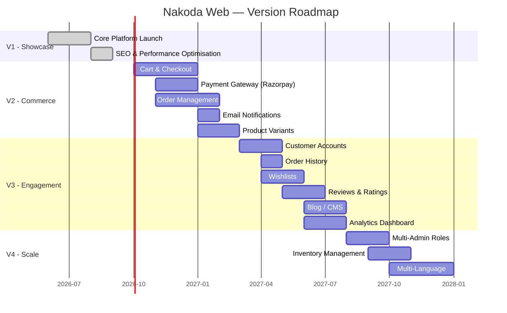

# Product Requirements Document — Nakoda Web

> **Version:** 1.0.0
> **Status:** Draft
> **Last Updated:** 2026-06-03
> **Author:** Product & Engineering Team
> **Stakeholders:** Store Owner, Development Team, Design Team

---

## Table of Contents

1. [Executive Summary](#1-executive-summary)
2. [Product Goals & Objectives](#2-product-goals--objectives)
3. [User Personas](#3-user-personas)
4. [Functional Requirements](#4-functional-requirements)
5. [Non-Functional Requirements](#5-non-functional-requirements)
6. [User Stories](#6-user-stories)
7. [Acceptance Criteria](#7-acceptance-criteria)
8. [Out of Scope (V1)](#8-out-of-scope-v1)
9. [Future Roadmap Considerations](#9-future-roadmap-considerations)
10. [Dependencies & Assumptions](#10-dependencies--assumptions)

---

## 1. Executive Summary

### 1.1 Product Vision

**Nakoda Web** is a modern, premium digital showcase platform purpose-built for a local jewellery retailer. It bridges the gap between the physical retail experience and the digital expectation of today's consumer — presenting exquisite jewellery collections online while channelling genuine purchase intent directly to the store via WhatsApp and structured inquiry forms.

### 1.2 Mission Statement

> *To empower local jewellery retailers with a world-class digital storefront that elevates brand perception, attracts new customers, and converts online interest into in-store visits and direct conversations — without the complexity of full e-commerce.*

### 1.3 Problem Statement

Local and regional jewellery retailers face a critical gap in their market positioning:

| Challenge | Impact |
|---|---|
| **No digital presence** | Losing customers to online-first competitors and larger brands with polished websites. |
| **Outdated websites** | Existing sites (if any) are static, non-responsive, and project a low-quality brand image inconsistent with premium merchandise. |
| **No self-service content management** | Store owners depend on developers or agencies for every product photo update, creating bottlenecks and recurring costs. |
| **Missed lead opportunities** | Potential customers researching jewellery online cannot discover, browse, or reach out to the retailer digitally. |
| **No structured inquiry channel** | Phone-only inquiry funnels lose after-hours leads and provide no record of customer interest for follow-up. |

The jewellery retail sector — especially at the local and regional level — has been slow to adopt digital-first strategies. Customers increasingly begin their jewellery purchase journey online: researching designs, comparing styles, and shortlisting pieces before visiting a store. Retailers without a compelling digital presence are invisible during this critical discovery phase.

### 1.4 Solution Overview

Nakoda Web delivers a two-part solution:

**1. Customer-Facing Showcase Website**
A visually stunning, mobile-first website that presents the retailer's complete jewellery catalogue with high-resolution imagery, intuitive browsing and filtering, and frictionless inquiry submission — via both structured forms and WhatsApp click-to-chat.

**2. Admin Portal**
A secure, self-service administration panel that empowers the store owner (or designated staff) to manage the entire product catalogue, organise categories and collections, and monitor incoming customer inquiries — all without developer intervention.

> [!IMPORTANT]
> **V1 is explicitly NOT an e-commerce platform.** There is no shopping cart, no checkout flow, no payment processing, and no order management. The platform is a **showcase + lead generation** tool. Purchase transactions happen offline (in-store or via direct communication).

### 1.5 Target Audience

| Audience Segment | Description |
|---|---|
| **Primary — End Consumers (B2C)** | Individuals browsing jewellery for personal purchase or gifting. Predominantly local/regional, ages 22–60, comfortable with WhatsApp as a communication channel. |
| **Secondary — Store Admin** | The store owner or a designated staff member responsible for keeping the online catalogue current and responding to inquiries. Non-technical user; requires an intuitive interface. |

### 1.6 V1 Scope Summary

| In Scope | Out of Scope |
|---|---|
| Product showcase with rich imagery | Shopping cart & checkout |
| Category & collection browsing | Payment processing |
| Search & multi-faceted filtering | Order management |
| Product inquiry via form | Customer account registration |
| WhatsApp click-to-chat integration | Wishlist / favourites |
| Admin product CRUD with image management | Multi-admin roles & permissions |
| Admin category & collection CRUD | Automated inventory tracking |
| Admin inquiry management | Email/SMS notifications |
| SEO optimisation (metadata, structured data, sitemap) | Analytics dashboard |
| Responsive, animated UI | Multi-language / i18n |

---

## 2. Product Goals & Objectives

### 2.1 Primary Goals

| # | Goal | Description |
|---|---|---|
| **G1** | **Digital Showcase Excellence** | Present the jewellery catalogue in a visually premium, brand-aligned digital experience that matches the quality of the physical merchandise. |
| **G2** | **Lead Generation** | Convert website visitors into qualified leads through WhatsApp click-to-chat and structured inquiry form submissions. Every product page is a lead generation surface. |
| **G3** | **Brand Elevation** | Establish the retailer as a modern, trustworthy, and premium brand in the local market through professional web presence. |

### 2.2 Secondary Goals

| # | Goal | Description |
|---|---|---|
| **G4** | **Admin Self-Service** | Eliminate developer dependency for day-to-day catalogue management. The store admin must be able to add, edit, and remove products (including images) independently. |
| **G5** | **SEO Discoverability** | Rank on the first page of local search results for relevant jewellery-related keywords (e.g., "gold jewellery [city name]", "diamond rings near me"). |
| **G6** | **Foundation for Growth** | Architect the platform so that e-commerce capabilities (cart, checkout, payments, accounts) can be layered on in V2+ without a re-write. |

### 2.3 Success Metrics & KPIs

| Metric | Definition | Target (6 months post-launch) |
|---|---|---|
| **Inquiry Conversion Rate** | % of unique visitors who submit an inquiry form or initiate a WhatsApp chat | ≥ 3% |
| **Average Time on Site** | Mean session duration across all visitors | ≥ 2 minutes |
| **Bounce Rate** | % of single-page sessions | ≤ 45% |
| **Pages per Session** | Average number of pages viewed per session | ≥ 3.5 |
| **Admin Adoption** | Frequency of admin portal usage (product adds/edits per week) | ≥ 3 actions/week |
| **Catalogue Freshness** | % of products with images updated within the last 90 days | ≥ 80% |
| **Lighthouse Performance Score** | Google Lighthouse aggregate performance score | ≥ 90 |
| **Organic Search Impressions** | Monthly impressions from Google Search Console | ≥ 5,000 |
| **Mobile Traffic Share** | % of total sessions from mobile devices | Tracking only (expect ≥ 60%) |
| **WhatsApp Click Rate** | % of product page views resulting in WhatsApp click | ≥ 5% |

### 2.4 Objectives & Key Results (OKRs)

**Objective 1: Launch a best-in-class jewellery showcase website**
- KR1: Achieve Lighthouse Performance score ≥ 90 on mobile
- KR2: Achieve Largest Contentful Paint (LCP) < 3 seconds on 4G
- KR3: Pass WCAG 2.1 AA automated accessibility audit with zero critical violations

**Objective 2: Generate measurable customer inquiries**
- KR1: Receive ≥ 50 inquiry form submissions in the first 3 months
- KR2: Achieve ≥ 100 WhatsApp click-to-chat initiations in the first 3 months
- KR3: Inquiry conversion rate ≥ 3% by month 6

**Objective 3: Empower the admin to manage the catalogue independently**
- KR1: Admin can add a new product (with 3 images) in under 5 minutes
- KR2: Admin requires zero developer assistance for routine operations within 2 weeks of launch
- KR3: 100% of catalogue updates performed by admin (not developers) by month 2

---

## 3. User Personas

### 3.1 Customer Persona — "Priya, the Jewellery Browser"

| Attribute | Detail |
|---|---|
| **Name** | Priya Sharma |
| **Age** | 32 |
| **Occupation** | Marketing Manager at a mid-size company |
| **Location** | Local city / metro area |
| **Tech Savviness** | Moderate — comfortable with smartphones, WhatsApp, and online browsing. Uses Instagram and Google for product research. |
| **Goals** | Browse jewellery designs for an upcoming anniversary gift. Compare styles across categories. Get pricing and availability information without visiting the store first. |
| **Pain Points** | Dislikes calling stores during work hours. Frustrated by jewellery websites with tiny, blurry images. Wants to save time by narrowing choices online before an in-store visit. |
| **Behaviours** | Browses primarily on mobile during commute or evenings. Prefers WhatsApp for quick questions. Will submit an inquiry form for detailed requests. Shares product links with partner for second opinions. |
| **Quote** | *"I want to see what's available before I make a trip to the store. If I can WhatsApp them with a specific piece, even better."* |

#### Priya's Journey

```
Discovers site via Google search ("gold necklace sets [city]")
    → Lands on homepage / category page
    → Browses products, applies filters (category, price range)
    → Views product detail page, swipes through gallery
    → Clicks "Inquire on WhatsApp" with pre-filled product details
    → Receives response from store → Visits store for purchase
```

### 3.2 Admin Persona — "Rajesh, the Store Owner"

| Attribute | Detail |
|---|---|
| **Name** | Rajesh Nakoda |
| **Age** | 48 |
| **Occupation** | Jewellery store owner (20+ years in business) |
| **Location** | Same city as the store |
| **Tech Savviness** | Low to moderate — uses a smartphone daily (WhatsApp, basic apps) but has limited experience with web-based admin tools. No coding knowledge. |
| **Goals** | Keep the online catalogue up to date with new arrivals. Showcase featured/bestselling pieces prominently. Monitor and respond to customer inquiries promptly. Build a modern brand image to compete with larger chains. |
| **Pain Points** | Currently relies on a developer to update the website — slow turnaround, recurring costs. Cannot quickly add new arrivals or seasonal collections. Has no visibility into online customer interest. |
| **Behaviours** | Accesses the admin portal from a desktop computer at the store or tablet. Uploads product photos taken on a smartphone. Checks inquiries daily. |
| **Quote** | *"I need to add new pieces myself, right when they arrive. I can't wait 3 days for a developer to update the website."* |

#### Rajesh's Journey

```
Logs into admin portal
    → Sees dashboard overview (new inquiries, product count)
    → Navigates to Products → "Add New Product"
    → Fills in details (name, description, category, price, weight)
    → Uploads 3-5 images, sets primary image
    → Marks product as "Featured" → Publishes
    → Checks Inquiries section → Reads new inquiry → Marks as read
    → Responds to customer via WhatsApp (outside the platform)
```

---

## 4. Functional Requirements

### 4.1 Customer-Facing Website

#### 4.1.1 Homepage

| ID | Requirement | Priority | Details |
|---|---|---|---|
| **FR-C-001** | Hero Section | P0 | Full-width hero banner with high-resolution jewellery imagery, headline text, and a primary CTA ("Explore Collection" or "Browse Jewellery"). Support for a single static hero image with overlay text. Animated entrance via Framer Motion. |
| **FR-C-002** | Featured Products Section | P0 | Display up to 8 products marked as "featured" by the admin. Each card shows: primary image, product name, category badge, and price (if visible). Clicking a card navigates to the product detail page. Responsive grid: 4 columns desktop, 2 columns tablet, 1-2 columns mobile. |
| **FR-C-003** | Category Showcase | P0 | Visual grid of all active categories with representative images and category names. Clicking a category navigates to the filtered product listing for that category. Animated on scroll. |
| **FR-C-004** | Store Information Summary | P1 | Compact section displaying store name, address, phone number, operating hours, and a "Get Directions" link (opens Google Maps). |
| **FR-C-005** | Call-to-Action Banner | P1 | A visually prominent banner encouraging visitors to inquire — linking to the contact/inquiry page or opening WhatsApp. |
| **FR-C-006** | Footer | P0 | Persistent site footer with: navigation links (Home, Products, Categories, About, Contact), social media icons, store address, phone number, WhatsApp link, and copyright notice. |

#### 4.1.2 Product Listing Page

| ID | Requirement | Priority | Details |
|---|---|---|---|
| **FR-C-010** | Product Grid | P0 | Paginated grid of product cards. Each card displays: primary image (with hover effect), product name, category, and price. Responsive layout (4/3/2/1 columns). Click navigates to product detail. |
| **FR-C-011** | Search | P0 | Text search input. Searches against product name and description. Debounced input (300ms). Results update the product grid in real-time. Server-side search via URL query parameters (bookmarkable/shareable). |
| **FR-C-012** | Filter: Category | P0 | Multi-select filter by product category. Options populated dynamically from existing categories. Applied via URL query parameters. |
| **FR-C-013** | Filter: Collection | P1 | Multi-select filter by collection. Options populated dynamically. |
| **FR-C-014** | Filter: Price Range | P1 | Predefined price range buckets (e.g., Under ₹10K, ₹10K–₹25K, ₹25K–₹50K, ₹50K–₹1L, Above ₹1L). Single or multi-select. |
| **FR-C-015** | Filter: Availability | P2 | Toggle to show only "In Stock" products. |
| **FR-C-016** | Sort Options | P1 | Sort by: Newest First (default), Price: Low to High, Price: High to Low, Name: A–Z. |
| **FR-C-017** | Pagination | P0 | Server-side pagination with configurable page size (default: 12). Show current page, total pages, and prev/next navigation. |
| **FR-C-018** | Empty State | P0 | When no products match search/filter criteria, display a friendly empty state with a message and a "Clear Filters" action. |
| **FR-C-019** | Filter Persistence via URL | P0 | All active filters, search query, sort order, and page number are reflected in the URL query string so that the state is bookmarkable, shareable, and preserved on browser back navigation. |

#### 4.1.3 Product Detail Page

| ID | Requirement | Priority | Details |
|---|---|---|---|
| **FR-C-020** | Image Gallery | P0 | Display all product images in a gallery format. Primary image shown large; thumbnails below/beside for additional images. Click thumbnail to swap main image. Support for at least 10 images per product. Images served via Cloudinary with optimised transformations (WebP, responsive sizing). |
| **FR-C-021** | Image Lightbox | P1 | Clicking the main image opens a full-screen lightbox/modal with swipe/arrow navigation between images. Pinch-to-zoom on mobile. |
| **FR-C-022** | Product Information | P0 | Display: product name, description (rich text/multi-paragraph), category (linked), collection (linked, if applicable), price (formatted with ₹ symbol and comma separators), weight (in grams), material/metal type, stock status ("In Stock" / "Made to Order"). |
| **FR-C-023** | Inquiry CTA — Form | P0 | Prominent "Inquire About This Product" button that scrolls to or opens an inline inquiry form. The form auto-fills the product reference (name + ID). |
| **FR-C-024** | Inquiry CTA — WhatsApp | P0 | "Chat on WhatsApp" button that opens WhatsApp (web or app) with a pre-filled message: *"Hi, I'm interested in [Product Name] (Ref: [Product Slug]). Please share more details."* Uses the `https://wa.me/<phone>?text=<encoded_message>` deep link format. |
| **FR-C-025** | Breadcrumb Navigation | P1 | Breadcrumb trail: Home > [Category Name] > [Product Name]. Each segment is clickable. Generates `BreadcrumbList` structured data. |
| **FR-C-026** | Related Products | P2 | Display up to 4 products from the same category (excluding the current product). Carousel or grid layout. |
| **FR-C-027** | Social Sharing | P2 | Share buttons for WhatsApp (primary), Facebook, and copy-link. |
| **FR-C-028** | SEO Metadata | P0 | Dynamic `<title>`, `<meta description>`, and Open Graph tags generated from product data. `Product` structured data (JSON-LD) with name, image, description, price, availability, brand, and URL. |

#### 4.1.4 Category Pages

| ID | Requirement | Priority | Details |
|---|---|---|---|
| **FR-C-030** | Category Listing Page | P0 | Page displaying all categories as visual cards with category image, name, and product count. Click navigates to the filtered product listing page for that category. |
| **FR-C-031** | Category Detail Page | P0 | Displays the category name, optional description, and a filtered product grid showing only products belonging to that category. Supports pagination, search, and sort within the category context. |
| **FR-C-032** | Category SEO | P1 | Each category page has a unique URL (`/categories/[slug]`), dynamic metadata, and optional `CollectionPage` structured data. |

#### 4.1.5 Collection Pages

| ID | Requirement | Priority | Details |
|---|---|---|---|
| **FR-C-035** | Collection Listing Page | P1 | Page displaying all collections with collection image (or hero image of a representative product), name, and description snippet. |
| **FR-C-036** | Collection Detail Page | P1 | Displays collection name, full description, and a filtered product grid. Supports pagination and sort. |
| **FR-C-037** | Collection SEO | P1 | Unique URL (`/collections/[slug]`), dynamic metadata. |

#### 4.1.6 Contact / Inquiry

| ID | Requirement | Priority | Details |
|---|---|---|---|
| **FR-C-040** | Inquiry Form | P0 | Standalone contact/inquiry page with a form containing the following fields: |

**Inquiry Form Fields:**

| Field | Type | Required | Validation | Notes |
|---|---|---|---|---|
| Full Name | Text | Yes | Min 2 chars, max 100 chars | — |
| Phone Number | Tel | Yes | Valid Indian mobile (10 digits) | Primary contact method |
| Email Address | Email | No | Valid email format | Optional secondary contact |
| Message | Textarea | Yes | Min 10 chars, max 1000 chars | Free-text inquiry |
| Product Reference | Hidden/Read-only | No | — | Auto-populated when navigating from a product detail page |

| ID | Requirement | Priority | Details |
|---|---|---|---|
| **FR-C-041** | Form Validation | P0 | Client-side validation with inline error messages on blur and on submit. Server-side validation via Server Action. Display success toast/message on successful submission. Display error message on failure. |
| **FR-C-042** | Honeypot Spam Protection | P1 | Include a hidden honeypot field to deter automated spam submissions. If the honeypot field is filled, silently discard the submission. |
| **FR-C-043** | Rate Limiting | P1 | Limit inquiry submissions to 5 per IP address per hour. Display a friendly message if the limit is reached. |
| **FR-C-044** | WhatsApp Global CTA | P0 | A floating WhatsApp button visible on all pages (bottom-right corner). Opens WhatsApp with a generic pre-filled message: *"Hi, I'd like to know more about your jewellery collection."* Subtle entrance animation. |

#### 4.1.7 Store Information & About

| ID | Requirement | Priority | Details |
|---|---|---|---|
| **FR-C-050** | Store Information Page | P1 | Dedicated page with: full store address, embedded Google Map (via iframe or static map image), phone number (click-to-call on mobile), WhatsApp number, email address, operating hours (day-by-day table), and parking/landmark directions. |
| **FR-C-051** | About Page | P1 | Brand story, history, values, and craftsmanship philosophy. Rich content with imagery. |
| **FR-C-052** | LocalBusiness Structured Data | P0 | `LocalBusiness` (or `JewelryStore`) JSON-LD structured data on the homepage and store info page, including: name, address, telephone, openingHours, geo coordinates, image, and URL. |

#### 4.1.8 SEO & Technical

| ID | Requirement | Priority | Details |
|---|---|---|---|
| **FR-C-060** | Dynamic Metadata | P0 | Every page generates a unique `<title>` and `<meta name="description">` via Next.js `generateMetadata`. Open Graph and Twitter Card meta tags on all pages. |
| **FR-C-061** | Structured Data | P0 | JSON-LD structured data: `Product` on product detail pages, `LocalBusiness` on homepage/store info, `BreadcrumbList` on all pages with breadcrumbs, `ItemList` on category/collection pages. |
| **FR-C-062** | XML Sitemap | P0 | Auto-generated `sitemap.xml` at `/sitemap.xml` including all public pages, product pages, category pages, and collection pages. Updated dynamically based on database content. |
| **FR-C-063** | Robots.txt | P0 | `/robots.txt` allowing all crawlers, referencing the sitemap URL. Disallowing `/admin/*` paths. |
| **FR-C-064** | Canonical URLs | P1 | Every page includes a `<link rel="canonical">` tag to prevent duplicate content issues. |
| **FR-C-065** | Image Optimisation | P0 | All images served via Cloudinary with automatic format (WebP/AVIF) and quality optimisation. Responsive `srcset` attributes. Lazy loading for below-the-fold images. Priority loading for hero and primary product images. |

#### 4.1.9 UI / UX & Animation

| ID | Requirement | Priority | Details |
|---|---|---|---|
| **FR-C-070** | Responsive Design | P0 | Mobile-first responsive design. Breakpoints: `sm` (640px), `md` (768px), `lg` (1024px), `xl` (1280px), `2xl` (1536px). All content must be fully usable on viewport widths from 320px to 2560px. |
| **FR-C-071** | Navigation — Desktop | P0 | Horizontal top navigation bar with logo, nav links (Home, Products, Categories, Collections, About, Contact), and a search icon/input. Sticky on scroll. |
| **FR-C-072** | Navigation — Mobile | P0 | Hamburger menu icon triggering a full-screen or slide-in mobile navigation drawer with all nav links. Smooth open/close animation via Framer Motion. |
| **FR-C-073** | Page Transitions | P2 | Subtle page-level entrance animations (fade-in, slide-up) using Framer Motion. |
| **FR-C-074** | Scroll Animations | P1 | Elements animate into view on scroll (fade-up, stagger children) using Framer Motion's `useInView` or `whileInView`. Performance-conscious — reduced motion for users with `prefers-reduced-motion`. |
| **FR-C-075** | Loading States | P0 | Skeleton loaders for product grids and images during data fetching. Spinner or progress indicator for form submissions. `loading.tsx` files for route-level suspense boundaries. |
| **FR-C-076** | Error States | P0 | User-friendly error pages (`error.tsx`, `not-found.tsx`). Inline error messages for form validation. Toast notifications for success/failure actions. |

---

### 4.2 Admin Portal

#### 4.2.1 Authentication

| ID | Requirement | Priority | Details |
|---|---|---|---|
| **FR-A-001** | Admin Login Page | P0 | Dedicated login page at `/admin/login` with email and password fields. Styled consistently with the admin portal design system. |
| **FR-A-002** | Auth.js Credentials Provider | P0 | Authentication via Auth.js (NextAuth v5) using the Credentials provider. Validates against a hashed password stored in the database (bcrypt). |
| **FR-A-003** | Session Management | P0 | JWT-based session management via Auth.js. Session persists across page reloads. Configurable session expiry (default: 24 hours). |
| **FR-A-004** | Protected Routes | P0 | All `/admin/*` routes (except `/admin/login`) are protected by Auth.js middleware. Unauthenticated requests redirect to `/admin/login`. |
| **FR-A-005** | Logout | P0 | "Sign Out" button in the admin navigation. Ends the session and redirects to `/admin/login`. |
| **FR-A-006** | Single Admin User | P0 | V1 supports a single admin user. The admin account is seeded via a CLI script (`prisma/seed.ts` or a dedicated script). No self-registration. |

#### 4.2.2 Dashboard

| ID | Requirement | Priority | Details |
|---|---|---|---|
| **FR-A-010** | Dashboard Overview | P0 | The admin landing page (`/admin`) displays summary statistics in card format: |

**Dashboard Cards:**

| Card | Data | Icon/Visual |
|---|---|---|
| Total Products | Count of all products | Package icon |
| Active Products | Count of products with `isActive: true` | Check icon |
| Total Categories | Count of all categories | Grid icon |
| Total Collections | Count of all collections | Layers icon |
| Total Inquiries | Count of all inquiries | MessageSquare icon |
| Unread Inquiries | Count of inquiries with `isRead: false` | Badge with count |

| ID | Requirement | Priority | Details |
|---|---|---|---|
| **FR-A-011** | Recent Activity Feed | P1 | Display the 5 most recently created/updated products and the 5 most recent inquiries in a timeline or list format. Each item is clickable, navigating to its detail/edit page. |
| **FR-A-012** | Quick Actions | P1 | Shortcut buttons: "Add New Product", "View Inquiries", "Manage Categories". |

#### 4.2.3 Product Management

| ID | Requirement | Priority | Details |
|---|---|---|---|
| **FR-A-020** | Product List View | P0 | Paginated table of all products with columns: thumbnail (primary image), name, category, price, stock status, featured status, created date, and action buttons (Edit, Delete). Sortable by name, price, and date. Searchable by name. |
| **FR-A-021** | Create Product | P0 | Form to create a new product with the following fields: |

**Product Form Fields:**

| Field | Type | Required | Validation | Notes |
|---|---|---|---|---|
| Name | Text | Yes | Min 2 chars, max 200 chars | Used to auto-generate slug |
| Slug | Text (auto-generated) | Yes | URL-safe, unique | Auto-generated from name; editable |
| Description | Textarea / Rich Text | Yes | Min 10 chars, max 5000 chars | Supports multi-paragraph text |
| Price | Number | Yes | Positive number, max 2 decimal places | Stored in paisa (smallest unit) or as Decimal |
| Weight | Number | No | Positive number | In grams |
| Material | Text / Select | No | — | e.g., Gold, Silver, Diamond, Platinum |
| Category | Select (dropdown) | Yes | Must reference existing category | Single category per product |
| Collection | Select (dropdown) | No | Must reference existing collection | Optional single collection |
| Is Featured | Toggle/Checkbox | No | Boolean, default: false | Featured products appear on homepage |
| Is Active | Toggle/Checkbox | No | Boolean, default: true | Inactive products hidden from customer site |
| In Stock | Toggle/Checkbox | No | Boolean, default: true | Controls stock badge on customer site |
| Images | File upload (multiple) | Yes (min 1) | Max 10 images, max 5MB each, JPEG/PNG/WebP | Uploaded to Cloudinary |

| ID | Requirement | Priority | Details |
|---|---|---|---|
| **FR-A-022** | Auto-Generate Slug | P0 | When the admin types a product name, the slug field auto-populates with a URL-safe version (lowercase, hyphens, no special characters). The slug must be unique. If a conflict exists, append a numeric suffix (e.g., `gold-ring-2`). The admin can manually override the auto-generated slug. |
| **FR-A-023** | Multi-Image Upload | P0 | Support drag-and-drop and click-to-browse file upload for multiple images simultaneously. Show upload progress for each image. Images are uploaded to Cloudinary via a Server Action. Display preview thumbnails after upload. |
| **FR-A-024** | Image Reordering | P0 | After upload, the admin can reorder images via drag-and-drop. The display order determines the sequence in the product gallery on the customer site. |
| **FR-A-025** | Set Primary Image | P0 | The admin can designate one image as the "primary" image (used as the thumbnail in product grids and cards). Default: the first image uploaded. |
| **FR-A-026** | Delete Individual Image | P0 | The admin can delete individual images from a product. Deleting an image removes it from both the database record and Cloudinary storage. If the deleted image was primary, the next image becomes primary. |
| **FR-A-027** | Edit Product | P0 | Pre-populated form identical to the create form. All fields are editable. Image management (add, reorder, set primary, delete) is available inline. |
| **FR-A-028** | Delete Product | P0 | Delete a product with a confirmation dialog ("Are you sure? This action cannot be undone."). Deleting a product also deletes all associated images from Cloudinary. Soft-delete is NOT required in V1 (hard delete). |
| **FR-A-029** | Mark as Featured | P0 | Toggle a product's "featured" status from the list view (inline toggle) or from the edit form. |
| **FR-A-030** | Toggle Active/Visibility | P0 | Toggle a product's active status. Inactive products are hidden from the customer-facing site but remain in the admin list (with a visual indicator). |
| **FR-A-031** | Bulk Actions | P2 | Select multiple products and apply bulk actions: Delete, Mark as Featured, Mark as Active/Inactive. Confirmation dialog required for destructive actions. |

#### 4.2.4 Category Management

| ID | Requirement | Priority | Details |
|---|---|---|---|
| **FR-A-040** | Category List View | P0 | Table or card grid of all categories with: name, slug, product count, and action buttons (Edit, Delete). |
| **FR-A-041** | Create Category | P0 | Form fields: Name (required, unique), Slug (auto-generated from name, editable, unique), Description (optional), Image (optional, single upload to Cloudinary). |
| **FR-A-042** | Edit Category | P0 | Pre-populated form. All fields editable. |
| **FR-A-043** | Delete Category | P0 | Confirmation dialog. Prevent deletion if the category has associated products (display count and require reassignment or product deletion first). Alternatively, block deletion with an error message: "Cannot delete category with [N] associated products." |
| **FR-A-044** | Category Slug Auto-Generation | P0 | Same slug generation logic as products (lowercase, hyphenated, unique). |

#### 4.2.5 Collection Management

| ID | Requirement | Priority | Details |
|---|---|---|---|
| **FR-A-050** | Collection List View | P1 | Table or card grid of all collections with: name, slug, product count, description snippet, and action buttons. |
| **FR-A-051** | Create Collection | P1 | Form fields: Name (required, unique), Slug (auto-generated, editable, unique), Description (required), Image (optional, single upload). |
| **FR-A-052** | Edit Collection | P1 | Pre-populated form. All fields editable. |
| **FR-A-053** | Delete Collection | P1 | Confirmation dialog. If the collection has associated products, the products are disassociated (their `collectionId` is set to `null`) — products are NOT deleted. |

#### 4.2.6 Inquiry Management

| ID | Requirement | Priority | Details |
|---|---|---|---|
| **FR-A-060** | Inquiry List View | P0 | Paginated table of all inquiries, sorted by newest first. Columns: customer name, phone, email (if provided), product reference (if any), date submitted, read status. Unread inquiries are visually highlighted (bold text or badge). |
| **FR-A-061** | Inquiry Detail View | P0 | Clicking an inquiry opens a detail view showing all submitted fields, the full message, and the associated product (if any, with a link to the product edit page). |
| **FR-A-062** | Mark as Read/Unread | P0 | Toggle an inquiry's read status. Opening an inquiry detail automatically marks it as read. A manual "Mark as Unread" action is available. |
| **FR-A-063** | Delete Inquiry | P1 | Delete an inquiry with a confirmation dialog. Hard delete. |
| **FR-A-064** | Inquiry Count Badge | P0 | The admin navigation displays a badge with the count of unread inquiries (e.g., "Inquiries (3)"). Updated on each page navigation. |

#### 4.2.7 Admin UI & Navigation

| ID | Requirement | Priority | Details |
|---|---|---|---|
| **FR-A-070** | Sidebar Navigation | P0 | Persistent sidebar with links: Dashboard, Products, Categories, Collections, Inquiries, and a "View Site" link (opens customer site in new tab). Collapsible on smaller screens. Active link highlighted. |
| **FR-A-071** | Admin Header | P0 | Top bar with: page title (dynamic based on current route), admin user display name/email, and a Sign Out button. |
| **FR-A-072** | Responsive Admin Layout | P1 | Admin portal is usable on tablets (≥ 768px). Sidebar collapses to a hamburger menu on tablet. Desktop-optimised by default. Mobile phone usage is not a primary target but should not break. |
| **FR-A-073** | Toast Notifications | P0 | Success/error toast notifications for all CRUD operations (e.g., "Product created successfully", "Failed to delete image"). Auto-dismiss after 5 seconds with a manual close button. |
| **FR-A-074** | Confirmation Dialogs | P0 | All destructive actions (delete product, delete category, delete image) require a confirmation dialog with clear messaging about the consequences. |
| **FR-A-075** | Form Auto-Save Indication | P2 | Visual indicator when unsaved changes exist on a form. Browser `beforeunload` warning if navigating away from an unsaved form. |

---

## 5. Non-Functional Requirements

### 5.1 Performance

| ID | Requirement | Target | Measurement |
|---|---|---|---|
| **NFR-001** | Lighthouse Performance Score | ≥ 90 (mobile) | Google Lighthouse CI / PageSpeed Insights |
| **NFR-002** | Largest Contentful Paint (LCP) | < 3.0 seconds | Core Web Vitals (real user data via Vercel Analytics or CrUX) |
| **NFR-003** | First Input Delay (FID) / Interaction to Next Paint (INP) | < 200ms | Core Web Vitals |
| **NFR-004** | Cumulative Layout Shift (CLS) | < 0.1 | Core Web Vitals |
| **NFR-005** | Time to First Byte (TTFB) | < 800ms | Server response time monitoring |
| **NFR-006** | Image Load Performance | Optimised WebP/AVIF, responsive srcset, lazy loading | Manual audit + Lighthouse |
| **NFR-007** | Bundle Size | JS bundle < 200KB gzipped (first load) | Vercel build output / `next build` analysis |
| **NFR-008** | Server Component Default | All components are Server Components by default; `"use client"` only when necessary (interactivity, hooks, browser APIs) | Code review |

### 5.2 Accessibility

| ID | Requirement | Target | Details |
|---|---|---|---|
| **NFR-010** | WCAG Compliance | WCAG 2.1 Level AA | All customer-facing pages must pass automated AA audit. |
| **NFR-011** | Keyboard Navigation | Full keyboard navigability | All interactive elements are focusable and operable via keyboard. Visible focus indicators. |
| **NFR-012** | Screen Reader Support | Semantic HTML + ARIA | Proper heading hierarchy, `alt` text on all images, ARIA labels on icon-only buttons, landmark regions. |
| **NFR-013** | Colour Contrast | ≥ 4.5:1 (normal text), ≥ 3:1 (large text) | All text meets contrast ratio requirements against backgrounds. |
| **NFR-014** | Reduced Motion | `prefers-reduced-motion` respected | When enabled, Framer Motion animations are disabled or reduced to simple fades. |
| **NFR-015** | Form Accessibility | Labelled inputs, error announcements | All form fields have associated `<label>` elements. Validation errors are announced to screen readers via `aria-live` regions. |

### 5.3 Security

| ID | Requirement | Details |
|---|---|---|
| **NFR-020** | Password Hashing | Admin passwords are hashed using `bcrypt` (min 10 salt rounds) before storage. Plain-text passwords are never stored or logged. |
| **NFR-021** | Protected Admin Routes | All `/admin/*` routes (except `/admin/login`) require an authenticated session. Enforced via Auth.js middleware at the edge. |
| **NFR-022** | CSRF Protection | Server Actions in Next.js provide built-in CSRF protection via origin checking. Verify this is enabled and not bypassed. |
| **NFR-023** | Input Sanitisation | All user inputs (inquiry form, admin forms) are validated and sanitised on the server side. Use Zod schemas for server-side validation. Prevent XSS by avoiding `dangerouslySetInnerHTML` (or sanitising if absolutely necessary). |
| **NFR-024** | Environment Variables | All secrets (database URL, Cloudinary credentials, Auth.js secret) stored as environment variables. Never committed to version control. `.env.example` provided with placeholder keys. |
| **NFR-025** | Rate Limiting on Inquiry Submission | Server-side rate limiting (5 submissions per IP per hour) to prevent abuse. |
| **NFR-026** | Cloudinary Upload Security | Uploads are performed server-side via Server Actions (not directly from the client). Cloudinary API credentials are never exposed to the browser. |
| **NFR-027** | Content Security Policy | Implement appropriate CSP headers to prevent XSS and data injection attacks. |
| **NFR-028** | HTTP Security Headers | Set `X-Content-Type-Options`, `X-Frame-Options`, `Referrer-Policy`, and `Strict-Transport-Security` headers via `next.config.ts` or middleware. |

### 5.4 Scalability & Extensibility

| ID | Requirement | Details |
|---|---|---|
| **NFR-030** | Database Schema Extensibility | Prisma schema designed to accommodate future entities (Orders, Customers, Cart, Wishlist) without breaking changes. Use proper relations and indexing. |
| **NFR-031** | Feature-Based Architecture | Codebase organised by feature (`src/features/products/`, `src/features/admin/`, etc.) to enable independent development of new features. |
| **NFR-032** | Separation of Concerns | Server Actions, database queries, validation schemas, UI components, and types are in separate files/modules. No monolithic files. |
| **NFR-033** | Multi-Admin Preparation | Database schema includes a `role` field on the User model (default: `ADMIN`). V1 ignores it, but the field is present for V2 role-based access control. |
| **NFR-034** | Connection Pooling | Use Neon's serverless driver or Prisma's connection pooling for PostgreSQL to handle serverless function concurrency. |

### 5.5 SEO

| ID | Requirement | Details |
|---|---|---|
| **NFR-040** | Server-Side Rendering | All customer-facing pages are server-rendered (React Server Components) for full SEO crawlability. No client-side-only content that search engines cannot index. |
| **NFR-041** | Dynamic Metadata | `generateMetadata` function on every page route for unique titles and descriptions. |
| **NFR-042** | Structured Data | JSON-LD on relevant pages (see FR-C-061). Validate using Google Rich Results Test. |
| **NFR-043** | Sitemap | Dynamic `sitemap.xml` (see FR-C-062). Submit to Google Search Console. |
| **NFR-044** | Image SEO | All images have descriptive `alt` text. Cloudinary image URLs are stable and crawlable. |
| **NFR-045** | URL Structure | Clean, semantic URLs: `/products/[slug]`, `/categories/[slug]`, `/collections/[slug]`. No query parameters in canonical URLs for individual resources. |

### 5.6 Browser Support

| Browser | Supported Versions |
|---|---|
| Google Chrome | Latest 2 major versions |
| Mozilla Firefox | Latest 2 major versions |
| Apple Safari | Latest 2 major versions (macOS + iOS) |
| Microsoft Edge | Latest 2 major versions |
| Samsung Internet | Latest 2 major versions |

> [!NOTE]
> Internet Explorer is NOT supported. Progressive enhancement is preferred over graceful degradation — core content and functionality must work in all supported browsers, even if advanced animations or visual effects are reduced.

### 5.7 Reliability & Availability

| ID | Requirement | Target |
|---|---|---|
| **NFR-050** | Uptime | 99.9% (Vercel SLA) |
| **NFR-051** | Error Handling | All Server Actions return structured error responses. UI displays user-friendly error messages. No unhandled promise rejections or uncaught exceptions in production. |
| **NFR-052** | Database Resilience | Neon PostgreSQL provides automatic failover. Application handles transient database connection errors gracefully (retry logic in critical paths). |
| **NFR-053** | Graceful Degradation | If Cloudinary is temporarily unavailable, product pages display a placeholder image rather than a broken image icon. |

---

## 6. User Stories

### 6.1 Customer User Stories

| ID | User Story | Priority | Acceptance Criteria Reference |
|---|---|---|---|
| **US-C-001** | As a **customer**, I want to **view featured jewellery on the homepage** so that I can **quickly discover popular or recommended pieces**. | P0 | AC-001 |
| **US-C-002** | As a **customer**, I want to **browse all products with pagination** so that I can **explore the full catalogue without overwhelming page loads**. | P0 | AC-002 |
| **US-C-003** | As a **customer**, I want to **search for products by name or keyword** so that I can **quickly find specific pieces I'm interested in**. | P0 | AC-003 |
| **US-C-004** | As a **customer**, I want to **filter products by category, collection, and price range** so that I can **narrow down options to my preferences**. | P0 | AC-004 |
| **US-C-005** | As a **customer**, I want to **view a product's detailed page with multiple high-quality images** so that I can **examine the piece closely before inquiring**. | P0 | AC-005 |
| **US-C-006** | As a **customer**, I want to **submit an inquiry about a specific product via a form** so that I can **get pricing, availability, or customisation details from the store**. | P0 | AC-006 |
| **US-C-007** | As a **customer**, I want to **initiate a WhatsApp chat about a specific product with one click** so that I can **get an immediate response from the store**. | P0 | AC-007 |
| **US-C-008** | As a **customer**, I want to **browse products by category** so that I can **explore specific types of jewellery (e.g., rings, necklaces, bangles)**. | P0 | AC-008 |
| **US-C-009** | As a **customer**, I want to **view store information including address, hours, and a map** so that I can **plan an in-store visit**. | P1 | AC-009 |
| **US-C-010** | As a **customer**, I want the **website to load quickly and display well on my mobile phone** so that I can **browse comfortably on any device**. | P0 | AC-010 |
| **US-C-011** | As a **customer**, I want to **share a product page link with someone via WhatsApp or other channels** so that I can **get a second opinion before inquiring**. | P2 | AC-011 |
| **US-C-012** | As a **customer**, I want to **see a floating WhatsApp button on every page** so that I can **easily reach the store from anywhere on the site**. | P0 | AC-012 |
| **US-C-013** | As a **customer**, I want to **browse products within a curated collection** so that I can **discover themed or seasonal groupings**. | P1 | AC-013 |
| **US-C-014** | As a **customer**, I want **product pages to appear in Google search results** so that I can **discover the store when searching for jewellery online**. | P0 | AC-014 |
| **US-C-015** | As a **customer**, I want to **sort products by price or newest arrivals** so that I can **find what's most relevant to my budget or interest in new designs**. | P1 | AC-015 |

### 6.2 Admin User Stories

| ID | User Story | Priority | Acceptance Criteria Reference |
|---|---|---|---|
| **US-A-001** | As an **admin**, I want to **log in securely to the admin portal** so that I can **manage the store's online presence**. | P0 | AC-101 |
| **US-A-002** | As an **admin**, I want to **see a dashboard overview of products and inquiries** so that I can **quickly assess the state of my online catalogue and customer interest**. | P0 | AC-102 |
| **US-A-003** | As an **admin**, I want to **add a new product with multiple images** so that I can **showcase new arrivals on the website**. | P0 | AC-103 |
| **US-A-004** | As an **admin**, I want to **edit an existing product's details and images** so that I can **keep the catalogue accurate and up to date**. | P0 | AC-104 |
| **US-A-005** | As an **admin**, I want to **delete a product and its associated images** so that I can **remove discontinued or sold-out items**. | P0 | AC-105 |
| **US-A-006** | As an **admin**, I want to **mark products as featured** so that they **appear prominently on the homepage**. | P0 | AC-106 |
| **US-A-007** | As an **admin**, I want to **manage categories (create, edit, delete)** so that I can **organise products logically for customers**. | P0 | AC-107 |
| **US-A-008** | As an **admin**, I want to **manage collections (create, edit, delete)** so that I can **create curated groupings for marketing or seasonal purposes**. | P1 | AC-108 |
| **US-A-009** | As an **admin**, I want to **view and manage customer inquiries** so that I can **respond to interested customers promptly**. | P0 | AC-109 |
| **US-A-010** | As an **admin**, I want to **reorder product images and set a primary image** so that I can **control which image appears as the thumbnail and the gallery order**. | P0 | AC-110 |
| **US-A-011** | As an **admin**, I want **slugs to be auto-generated from product/category names** so that I can **avoid manually creating URL-safe identifiers**. | P0 | AC-111 |
| **US-A-012** | As an **admin**, I want to **toggle a product's visibility (active/inactive)** so that I can **temporarily hide products without deleting them**. | P0 | AC-112 |
| **US-A-013** | As an **admin**, I want to **see a badge count of unread inquiries** so that I can **know immediately if new inquiries have arrived**. | P0 | AC-113 |
| **US-A-014** | As an **admin**, I want to **toggle a product's stock status** so that customers **see accurate availability information**. | P1 | AC-114 |
| **US-A-015** | As an **admin**, I want to **navigate to the customer-facing site from the admin portal** so that I can **preview how my changes look to customers**. | P1 | AC-115 |

---

## 7. Acceptance Criteria

### 7.1 Customer-Facing Acceptance Criteria

#### AC-001: Homepage Featured Products

```
GIVEN   I am a customer visiting the homepage
WHEN    the page loads
THEN    I see a hero section with a headline and CTA button
AND     I see a "Featured Products" section displaying up to 8 products
AND     each product card shows: image, name, category, and price
AND     clicking a product card navigates me to the product detail page
AND     the page loads within 3 seconds on a 4G connection
```

#### AC-002: Product Listing with Pagination

```
GIVEN   I am on the product listing page
WHEN    there are more than 12 products in the catalogue
THEN    I see the first 12 products in a responsive grid
AND     I see pagination controls (page numbers, prev/next)
AND     clicking "Next" or a page number loads the corresponding page
AND     the URL updates with the page parameter (e.g., ?page=2)
AND     navigating back restores the previous page state
```

#### AC-003: Product Search

```
GIVEN   I am on the product listing page
WHEN    I type "gold necklace" in the search input
THEN    after a 300ms debounce, the product grid updates to show only matching products
AND     the URL updates with the search parameter (e.g., ?search=gold+necklace)
AND     the search matches against product name and description
AND     if no results match, I see an empty state with "No products found" and a "Clear Search" button
```

#### AC-004: Product Filtering

```
GIVEN   I am on the product listing page
WHEN    I select the "Necklaces" category filter
THEN    the product grid updates to show only necklaces
AND     the URL updates with the filter parameter (e.g., ?category=necklaces)
AND     I can add additional filters (e.g., price range) cumulatively
AND     I see the count of matching products
AND     I can clear individual filters or all filters at once
```

#### AC-005: Product Detail Page

```
GIVEN   I am viewing a product detail page for "Diamond Solitaire Ring"
THEN    I see the product name "Diamond Solitaire Ring" as the page heading
AND     I see all product images with the primary image displayed prominently
AND     I can click thumbnails to switch the main image
AND     I see: description, price (₹-formatted), weight, material, category, stock status
AND     I see breadcrumb navigation: Home > Rings > Diamond Solitaire Ring
AND     the page has appropriate meta title, description, and Product structured data
```

#### AC-006: Inquiry Form Submission

```
GIVEN   I am on the inquiry form page (or inline on a product detail page)
WHEN    I fill in Name, Phone, and Message (and optionally Email)
AND     I click "Submit Inquiry"
THEN    the form validates all required fields
AND     if validation passes, the inquiry is saved to the database
AND     I see a success message: "Thank you for your inquiry! We'll get back to you shortly."
AND     the form fields are cleared
AND     if the inquiry was from a product page, the product reference is included in the submission
```

#### AC-007: WhatsApp Click-to-Chat

```
GIVEN   I am on a product detail page for "Gold Temple Necklace"
WHEN    I click the "Chat on WhatsApp" button
THEN    WhatsApp opens (app or web) with the store's number pre-filled
AND     the message is pre-filled: "Hi, I'm interested in Gold Temple Necklace (Ref: gold-temple-necklace). Please share more details."
AND     on mobile, the WhatsApp app opens directly
AND     on desktop, WhatsApp Web opens in a new tab
```

#### AC-008: Category Browsing

```
GIVEN   I am on the categories page
THEN    I see all active categories displayed as visual cards with images and names
AND     each card shows the number of products in that category
WHEN    I click on the "Bangles" category card
THEN    I navigate to /categories/bangles
AND     I see only products belonging to the "Bangles" category
AND     I can still search, sort, and paginate within this filtered view
```

#### AC-009: Store Information

```
GIVEN   I navigate to the store information page
THEN    I see the complete store address
AND     I see an embedded map showing the store location
AND     I see the phone number (clickable on mobile to initiate a call)
AND     I see operating hours for each day of the week
AND     I see a "Get Directions" link that opens Google Maps with the store's location
```

#### AC-010: Mobile Responsiveness

```
GIVEN   I am accessing the website on a mobile device (320px–480px viewport)
THEN    all content is readable without horizontal scrolling
AND     the navigation uses a hamburger menu that opens a mobile drawer
AND     product grids display in 1–2 columns
AND     images scale appropriately and are not cropped poorly
AND     touch targets are at least 44x44px
AND     the floating WhatsApp button does not overlap critical content
```

#### AC-011: Product Sharing

```
GIVEN   I am on a product detail page
WHEN    I click the "Share" / WhatsApp share button
THEN    a share option opens with the product page URL pre-filled
AND     the shared URL includes proper Open Graph metadata (title, description, image)
AND     when someone opens the shared link, they see the correct product page
```

#### AC-012: Floating WhatsApp Button

```
GIVEN   I am on any page of the website
THEN    I see a floating WhatsApp icon button in the bottom-right corner
AND     it does not obscure critical page content or other CTAs
WHEN    I click the button
THEN    WhatsApp opens with the store's number and a generic message pre-filled
```

#### AC-013: Collection Browsing

```
GIVEN   I navigate to the collections page
THEN    I see all active collections with name, description snippet, and image
WHEN    I click on a collection
THEN    I navigate to /collections/[slug]
AND     I see the collection's full description and all associated products
```

#### AC-014: SEO & Discoverability

```
GIVEN   a search engine crawler visits the website
THEN    the homepage has LocalBusiness structured data
AND     each product page has Product structured data with name, image, price, and availability
AND     each page has a unique <title> and <meta description>
AND     /sitemap.xml returns a valid XML sitemap listing all public pages
AND     /robots.txt allows crawling and references the sitemap
AND     all pages return server-rendered HTML (not client-side-only shells)
```

#### AC-015: Product Sorting

```
GIVEN   I am on the product listing page
WHEN    I select "Price: Low to High" from the sort dropdown
THEN    the products re-order by ascending price
AND     the URL updates with the sort parameter (e.g., ?sort=price_asc)
AND     the sort persists when combined with filters and pagination
```

### 7.2 Admin Acceptance Criteria

#### AC-101: Admin Login

```
GIVEN   I navigate to /admin/login
WHEN    I enter valid admin credentials (email + password)
AND     click "Sign In"
THEN    I am authenticated and redirected to /admin (dashboard)
AND     my session persists across page refreshes

GIVEN   I enter invalid credentials
THEN    I see an error message: "Invalid email or password"
AND     I am NOT redirected

GIVEN   I try to access /admin/products without being logged in
THEN    I am redirected to /admin/login
```

#### AC-102: Admin Dashboard

```
GIVEN   I am logged into the admin portal
WHEN    I view the dashboard (/admin)
THEN    I see cards displaying: Total Products, Active Products, Total Categories, Total Collections, Total Inquiries, Unread Inquiries
AND     each count is accurate and reflects the current database state
AND     I see a list of 5 most recent products and 5 most recent inquiries
AND     I see quick action buttons for common tasks
```

#### AC-103: Create Product

```
GIVEN   I am on the "Add New Product" page
WHEN    I fill in: Name ("Gold Filigree Earrings"), Description, Price (15000), Category (Earrings)
AND     I upload 3 images (drag-and-drop or file browser)
AND     I click "Save Product"
THEN    a new product is created in the database with a generated slug ("gold-filigree-earrings")
AND     all 3 images are uploaded to Cloudinary and linked to the product
AND     the first uploaded image is set as the primary image
AND     I see a success toast: "Product created successfully"
AND     I am redirected to the product list or the product edit page
AND     the product is visible on the customer-facing website
```

#### AC-104: Edit Product

```
GIVEN   I am on the edit page for an existing product
WHEN    I change the price from ₹15,000 to ₹18,000
AND     I upload 1 new image and delete 1 existing image
AND     I click "Save Changes"
THEN    the product's price is updated to ₹18,000
AND     the new image is uploaded to Cloudinary and linked
AND     the deleted image is removed from both the database and Cloudinary
AND     I see a success toast: "Product updated successfully"
AND     the changes are reflected on the customer-facing site immediately
```

#### AC-105: Delete Product

```
GIVEN   I am on the product list
WHEN    I click "Delete" on a product
THEN    a confirmation dialog appears: "Are you sure you want to delete 'Gold Filigree Earrings'? This action cannot be undone."
WHEN    I confirm the deletion
THEN    the product is removed from the database
AND     all associated images are deleted from Cloudinary
AND     I see a success toast: "Product deleted successfully"
AND     the product no longer appears on the customer-facing site
```

#### AC-106: Feature Product

```
GIVEN   I am viewing the product list
WHEN    I toggle the "Featured" switch on a product
THEN    the product's featured status is updated immediately
AND     if marked as featured, the product appears in the homepage "Featured Products" section
AND     if unmarked, the product is removed from the homepage section
AND     I see a brief toast confirming the change
```

#### AC-107: Category Management

```
GIVEN   I create a new category with name "Anklets"
THEN    the slug "anklets" is auto-generated
AND     the category appears in the category list and in product form dropdowns

GIVEN   I try to delete a category that has 5 associated products
THEN    I see an error: "Cannot delete 'Anklets' — 5 products are assigned to this category. Reassign or delete them first."
AND     the category is NOT deleted
```

#### AC-108: Collection Management

```
GIVEN   I create a new collection with name "Diwali 2026 Special" and a description
THEN    the slug "diwali-2026-special" is auto-generated
AND     the collection is visible on the customer-facing collections page

GIVEN   I delete a collection that has associated products
THEN    the collection is deleted
AND     associated products have their collection reference set to null
AND     the products are NOT deleted
```

#### AC-109: Inquiry Management

```
GIVEN   a customer submits an inquiry form
THEN    the inquiry appears in the admin inquiry list with "Unread" status
AND     the unread inquiry count badge in the navigation increments

WHEN    I click on the inquiry to view details
THEN    I see all submitted fields (name, phone, email, message, product reference)
AND     the inquiry is automatically marked as "Read"
AND     the unread count badge decrements
```

#### AC-110: Image Management

```
GIVEN   I am editing a product with 5 images
WHEN    I drag the 3rd image to the 1st position
THEN    the image order updates and the change is saved
AND     the customer-facing gallery reflects the new order

WHEN    I click "Set as Primary" on the 2nd image
THEN    the 2nd image becomes the primary image
AND     it is used as the thumbnail in product grids on the customer site
```

#### AC-111: Slug Auto-Generation

```
GIVEN   I am creating a product and I type "22K Gold Temple Necklace" in the name field
THEN    the slug field auto-populates with "22k-gold-temple-necklace"
AND     I can manually edit the slug if I want a different URL

GIVEN   a product with slug "gold-ring" already exists
WHEN    I create a new product named "Gold Ring"
THEN    the auto-generated slug becomes "gold-ring-2" (or similar to ensure uniqueness)
```

#### AC-112: Product Visibility Toggle

```
GIVEN   I toggle a product's visibility to "Inactive"
THEN    the product no longer appears on the customer-facing website
AND     the product remains in the admin product list with an "Inactive" visual indicator
AND     I can re-activate the product at any time
```

#### AC-113: Unread Inquiry Badge

```
GIVEN   there are 3 unread inquiries
THEN    the admin sidebar shows "Inquiries (3)" with a badge
WHEN    I read all 3 inquiries
THEN    the badge disappears or shows "Inquiries (0)"
AND     the count updates without requiring a full page reload
```

#### AC-114: Stock Status Toggle

```
GIVEN   I toggle a product's stock status to "Out of Stock"
THEN    the customer-facing product page shows "Out of Stock" or "Made to Order" status
AND     the product remains visible (not hidden) on the customer site
AND     customers can still submit inquiries about the product
```

#### AC-115: View Customer Site from Admin

```
GIVEN   I am in the admin portal
WHEN    I click the "View Site" link in the sidebar
THEN    the customer-facing homepage opens in a new browser tab
AND     I can navigate the customer site independently
```

---

## 8. Out of Scope (V1)

The following features are explicitly **excluded** from the V1 release. They are documented here to set clear expectations and to inform future roadmap planning.

| Feature | Reason for Exclusion | Planned Version |
|---|---|---|
| **Shopping Cart** | V1 is a showcase/inquiry platform, not an e-commerce store. Cart functionality requires session management, state persistence, and UI complexity beyond the initial scope. | V2 |
| **Online Checkout & Payment Processing** | Requires payment gateway integration (Razorpay, Stripe), order lifecycle management, refund handling, and compliance considerations. | V2 |
| **Order Management** | No orders exist without a checkout flow. Order tracking, fulfilment status, and history are deferred to V2. | V2 |
| **Customer Account Registration & Login** | V1 does not require user accounts. Inquiries are anonymous (name + phone). Customer accounts are needed for cart persistence, order history, and wishlists. | V3 |
| **Wishlist / Favourites** | Requires customer accounts. A wishlist feature allows customers to save products for later — useful but not critical for a showcase platform. | V3 |
| **Multi-Admin Roles & Permissions** | V1 has a single admin user. Role-based access control (e.g., Owner, Manager, Staff with different permissions) is a V4 feature. | V4 |
| **Automated Inventory Tracking** | V1 has a simple "in stock" toggle. Real-time inventory sync, stock levels, low-stock alerts, and SKU management are deferred. | V4 |
| **Email / SMS Notifications** | No automated notifications in V1. Inquiry confirmations, order updates, and marketing emails require an email service integration (SendGrid, Resend) and notification preferences. | V2 |
| **Analytics Dashboard (Built-in)** | V1 relies on Vercel Analytics and Google Analytics for traffic insights. A built-in admin analytics dashboard with conversion funnels and product performance metrics is deferred. | V3 |
| **Multi-Language / i18n** | The initial target audience speaks English and Hindi. Full multi-language support with translated content management is a future consideration. | V4+ |
| **Product Reviews / Ratings** | Requires customer accounts and moderation tools. | V3 |
| **Product Variants (Sizes, Colours)** | V1 treats each product as a single SKU. Variant management (e.g., ring sizes, metal colours) adds significant complexity. | V2 |
| **Blog / Content Management** | A blog for SEO content marketing and brand storytelling is valuable but beyond V1 scope. | V3 |
| **Progressive Web App (PWA)** | Offline capability and install prompts are nice-to-have for a future version. | V3 |
| **Live Chat / Chatbot** | Real-time chat or AI-powered chatbot for customer support. WhatsApp serves as the primary communication channel in V1. | V4+ |

> [!WARNING]
> Do not introduce any checkout, payment, or order functionality into V1 under any circumstances. The architecture should be prepared for these features (extensible schema, modular code), but no UI, logic, or database tables related to purchasing should be built.

---

## 9. Future Roadmap Considerations

### 9.1 Version Roadmap



### 9.2 V2 — Commerce (Estimated: Q4 2026 – Q1 2027)

| Feature | Description | Key Decisions |
|---|---|---|
| **Shopping Cart** | Session-based (anonymous) and account-based cart. Add-to-cart on product listing and detail pages. Cart sidebar/page with quantity adjustment and removal. | Session storage strategy (cookie vs database), cart merging on login |
| **Checkout Flow** | Multi-step or single-page checkout: shipping address, contact details, order review, payment. | Guest checkout vs account-required, address validation |
| **Payment Gateway** | Integration with Razorpay (primary) and/or Stripe. Support for UPI, cards, net banking. | Gateway selection, webhook handling, refund flow |
| **Order Management (Admin)** | Admin view of all orders with status tracking (Placed, Confirmed, Shipped, Delivered, Cancelled). | Order state machine, notification triggers |
| **Email Notifications** | Transactional emails: inquiry confirmation, order confirmation, shipping update. | Email service (Resend / SendGrid), template design |
| **Product Variants** | Support for product variants (e.g., ring sizes, metal types) with individual pricing and stock. | Variant data model, UI for variant selection |

### 9.3 V3 — Engagement (Estimated: Q1 – Q3 2027)

| Feature | Description |
|---|---|
| **Customer Accounts** | Registration, login (email/password + OAuth), profile management, address book. |
| **Order History** | Customers can view past orders, track status, and re-order. |
| **Wishlists** | Save products to a personal wishlist. Share wishlists. |
| **Reviews & Ratings** | Customers can leave star ratings and text reviews on purchased products. Admin moderation. |
| **Blog / CMS** | Integrated blog for content marketing, jewellery guides, and brand storytelling. SEO benefits. |
| **Analytics Dashboard** | Built-in admin analytics: top products, conversion funnel, revenue metrics, inquiry trends. |

### 9.4 V4 — Scale (Estimated: Q3 2027 – Q1 2028)

| Feature | Description |
|---|---|
| **Multi-Admin Roles** | Role-based access control: Owner (full access), Manager (products + inquiries), Staff (read-only). |
| **Inventory Management** | Real-time stock levels, low-stock alerts, SKU management, purchase order tracking. |
| **Multi-Language (i18n)** | English and Hindi content with language switcher. Admin can manage translations. |
| **Multi-Store** | Support for multiple store locations with individual catalogues and contact info. |
| **Live Chat** | Integrated live chat widget or AI chatbot for customer support. |

---

## 10. Dependencies & Assumptions

### 10.1 Technical Dependencies

| Dependency | Purpose | Version / Details | Criticality |
|---|---|---|---|
| **Next.js** | Full-stack React framework (App Router) | 15.x | Critical — core framework |
| **React** | UI component library | 19.x | Critical — rendering engine |
| **TypeScript** | Type-safe JavaScript | 5.x | Critical — development language |
| **Tailwind CSS** | Utility-first CSS framework | v4 | Critical — styling system |
| **Framer Motion** | Animation library for React | Latest | High — UI animations |
| **Prisma ORM** | Database toolkit and ORM | Latest | Critical — database access layer |
| **Neon PostgreSQL** | Serverless PostgreSQL database | Managed service | Critical — data storage |
| **Auth.js (NextAuth v5)** | Authentication library | v5 (beta/stable) | Critical — admin auth |
| **Cloudinary** | Cloud-based image management | Managed service | Critical — image storage & CDN |
| **Vercel** | Hosting and deployment platform | Managed service | Critical — hosting, CI/CD, edge |
| **Zod** | Runtime schema validation | Latest | High — input validation |
| **bcrypt / bcryptjs** | Password hashing | Latest | High — security |
| **Lucide React** | Icon library | Latest | Medium — UI icons |

### 10.2 External Service Dependencies

| Service | Account Required | Free Tier Sufficient? | Notes |
|---|---|---|---|
| **Neon** | Yes | Yes (for V1 scale) | Free tier: 0.5 GB storage, 190 compute hours/month. Sufficient for initial product catalogue and inquiries. |
| **Cloudinary** | Yes | Yes (for V1 scale) | Free tier: 25 credits/month (~25GB storage or 25GB bandwidth). Sufficient for initial catalogue of ~100-200 products with 3-5 images each. |
| **Vercel** | Yes | Yes (Hobby plan for launch, Pro recommended for production) | Hobby plan includes serverless functions, edge middleware, and custom domain. Pro plan needed for team features and higher limits. |
| **Google Maps** | Optional | Embed (no API key for basic iframe) | Basic Google Maps embed via iframe does not require an API key. Interactive Maps API requires a key. |
| **WhatsApp** | Store's WhatsApp Business number | Yes | No API integration needed. Uses `wa.me` deep links only. |

### 10.3 Assumptions

| # | Assumption | Impact if Invalid |
|---|---|---|
| **A1** | The store has a WhatsApp Business number active and monitored during business hours. | WhatsApp CTA becomes ineffective; fallback to inquiry form only. |
| **A2** | Product photographs are provided by the store in sufficient quality (≥ 1000px wide, well-lit, clean background). | Poor image quality degrades the premium brand perception. May need photography guidance or editing support. |
| **A3** | The admin (store owner) is available for 2-3 hours of training on the admin portal. | Without training, admin adoption may be slow, leading to an outdated catalogue. |
| **A4** | The initial product catalogue contains 50–200 products across 5–15 categories. | If significantly larger, performance testing and pagination strategies may need adjustment. |
| **A5** | A single admin user is sufficient for V1. | If multiple staff need access before V2, a shared credential workaround may be needed (not ideal). |
| **A6** | The store operates from a single physical location. | Multi-location support requires schema changes and additional store info pages. |
| **A7** | Indian Rupee (₹ / INR) is the only currency. | Multi-currency support would require significant changes to pricing display and storage. |
| **A8** | The store has a custom domain name procured and DNS access available. | Delays in domain setup can block the production launch. |
| **A9** | All product information (names, descriptions, prices, weights) will be entered in English. | Hindi or bilingual content would require i18n infrastructure. |
| **A10** | Vercel's serverless function cold start times (< 1 second) are acceptable for admin operations. | If cold starts cause poor admin UX, consider Vercel's "Always On" or edge functions for critical paths. |

### 10.4 Constraints

| # | Constraint | Details |
|---|---|---|
| **C1** | **Budget** | Free/hobby tiers of all external services for initial launch. Upgrade path identified for growth. |
| **C2** | **Timeline** | V1 MVP targeted for launch within 8–10 weeks of development start. |
| **C3** | **Team Size** | Single full-stack developer (or very small team). Architecture must be manageable by a small team. |
| **C4** | **No Native App** | V1 is web-only. No iOS/Android app development. Mobile experience via responsive web design. |
| **C5** | **No Third-Party CMS** | Content is managed directly via the custom admin portal, not a headless CMS (Sanity, Strapi, etc.). |
| **C6** | **Single Language** | English only in V1. No i18n infrastructure required. |

### 10.5 Risks & Mitigations

| Risk | Likelihood | Impact | Mitigation |
|---|---|---|---|
| **Admin does not adopt the portal** | Medium | High — catalogue becomes stale | Provide hands-on training, create a quick-start guide, design for simplicity over features. |
| **Low inquiry volume** | Medium | High — undermines business case | Invest in local SEO, add compelling CTAs, track and optimise conversion funnel. |
| **Cloudinary free tier exceeded** | Low (V1) | Medium — images stop loading | Monitor usage, implement image compression before upload, upgrade plan as needed. |
| **Neon free tier exceeded** | Low (V1) | High — site goes down | Monitor database size and compute, prune old data if needed, upgrade plan. |
| **Poor product photography** | Medium | High — degrades brand perception | Provide photography guidelines to store owner, consider basic image enhancement in Cloudinary. |
| **WhatsApp number unmonitored** | Low | Medium — lost leads | Set WhatsApp Business auto-replies for after-hours messages. |
| **SEO takes months to show results** | High | Medium — no organic traffic initially | Supplement with Google Business Profile, social media, and potential Google Ads. |
| **Scope creep into e-commerce features** | Medium | High — delays V1 launch | Strict adherence to this PRD. All checkout/cart requests deferred to V2 backlog. |

---

## Appendix A: Glossary

| Term | Definition |
|---|---|
| **CTA** | Call to Action — a UI element (button, link, banner) prompting the user to take a specific action. |
| **CRUD** | Create, Read, Update, Delete — the four basic database operations. |
| **CMS** | Content Management System — a tool for managing digital content (not used in V1; custom admin portal instead). |
| **JSON-LD** | JavaScript Object Notation for Linked Data — a structured data format used for SEO. |
| **LCP** | Largest Contentful Paint — a Core Web Vital measuring perceived load speed. |
| **CLS** | Cumulative Layout Shift — a Core Web Vital measuring visual stability. |
| **INP** | Interaction to Next Paint — a Core Web Vital measuring responsiveness. |
| **WCAG** | Web Content Accessibility Guidelines — international standard for web accessibility. |
| **CSRF** | Cross-Site Request Forgery — a web security vulnerability. |
| **SSR** | Server-Side Rendering — generating HTML on the server for each request. |
| **RSC** | React Server Components — components that render exclusively on the server. |
| **Server Actions** | Next.js feature allowing server-side mutation functions called directly from client components. |

---

## Appendix B: Reference Wireframes & Information Architecture

### B.1 Site Map

```mermaid
graph TD
    A["Homepage /"] --> B["Products /products"]
    A --> C["Categories /categories"]
    A --> D["Collections /collections"]
    A --> E["About /about"]
    A --> F["Contact /contact"]
    A --> G["Store Info /store"]
    
    B --> B1["Product Detail /products/slug"]
    C --> C1["Category Detail /categories/slug"]
    D --> D1["Collection Detail /collections/slug"]
    
    H["Admin Portal /admin"] --> H1["Dashboard /admin"]
    H --> H2["Products /admin/products"]
    H --> H3["Categories /admin/categories"]
    H --> H4["Collections /admin/collections"]
    H --> H5["Inquiries /admin/inquiries"]
    
    H2 --> H2a["Add Product /admin/products/new"]
    H2 --> H2b["Edit Product /admin/products/id/edit"]
    H3 --> H3a["Add Category /admin/categories/new"]
    H3 --> H3b["Edit Category /admin/categories/id/edit"]
    H4 --> H4a["Add Collection /admin/collections/new"]
    H4 --> H4b["Edit Collection /admin/collections/id/edit"]
    H5 --> H5a["Inquiry Detail /admin/inquiries/id"]
    
    I["Login /admin/login"]

    style A fill:#4CAF50,color:#fff
    style H fill:#2196F3,color:#fff
    style I fill:#FF9800,color:#fff
```



### B.2 Admin Portal Navigation Structure

```
/admin
├── Dashboard (overview stats + recent activity)
├── Products
│   ├── Product List (table with search, sort, pagination)
│   ├── Add New Product (form + image upload)
│   └── Edit Product (form + image management)
├── Categories
│   ├── Category List
│   ├── Add Category
│   └── Edit Category
├── Collections
│   ├── Collection List
│   ├── Add Collection
│   └── Edit Collection
├── Inquiries
│   ├── Inquiry List (table with read/unread status)
│   └── Inquiry Detail (full message view)
└── [Sidebar]
    ├── View Site → (opens customer site in new tab)
    └── Sign Out
```

---

## Appendix C: Data Model Summary

> [!NOTE]
> This is a high-level summary. The detailed database schema is documented in the Technical Architecture Document.

| Entity | Key Fields | Relations |
|---|---|---|
| **User** | id, email, passwordHash, name, role | — |
| **Product** | id, name, slug, description, price, weight, material, isFeatured, isActive, inStock, categoryId, collectionId, createdAt, updatedAt | belongs to Category, belongs to Collection (optional), has many Images |
| **Category** | id, name, slug, description, image, createdAt, updatedAt | has many Products |
| **Collection** | id, name, slug, description, image, createdAt, updatedAt | has many Products |
| **Image** | id, url, publicId, alt, isPrimary, displayOrder, productId, createdAt | belongs to Product |
| **Inquiry** | id, name, phone, email, message, productId, isRead, createdAt | belongs to Product (optional) |

---

*Document ends. For technical implementation details, refer to the [Technical Architecture Document](./TECHNICAL_ARCHITECTURE.md) and [Database Schema Document](./DATABASE_SCHEMA.md).*
